# Trabajo Práctico 1 - Git Básico

### 1. Instalar Git
En mi caso ya lo tengo instalado:
   
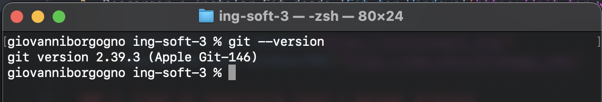

### 2. Crear un repositorio local y agregar archivos
1. Crear un repositorio local:
   ```bash
   mkdir mi_repositorio
   cd mi_repositorio
   git init
   ```
2. Agregar un archivo `README.md` con contenido:
   ```bash
   echo "# Mi Proyecto" > README.md
   ```
3. Hacer un commit con un mensaje descriptivo:
   ```bash
   git add README.md
   git commit -m "Agregar archivo Readme con título de proyecto"
   ```
   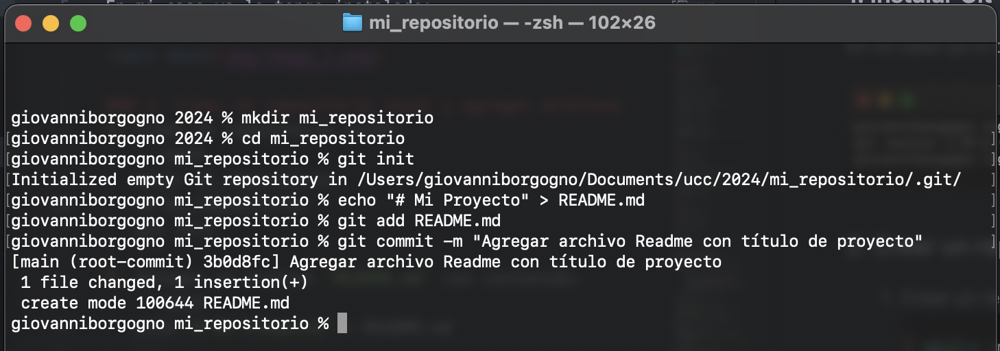

### 3. Configuración del Editor Predeterminado
1. En mi caso uso Visual Studio Code
2. Configurar como editor predeterminado:
   ```bash
   git config --global core.editor "code --wait"
   ```

### 4. Creación de Repos 01 -> Crearlo en GitHub, clonarlo localmente y subir cambios
1. Crear una cuenta en GitHub: https://github.com/giovaborgogno
2. Crear un nuevo repositorio en GitHub con `README.md` por defecto.
   
3. Clonar el repositorio remoto:
   ```bash
   git clone https://github.com/giovaborgogno/mi_repositorio.git
   cd mi_repositorio
   ```
4. Editar el archivo `README.md`:
   ```bash
   echo "Agregando más información" >> README.md
   ```
5. Crear el archivo `.gitignore`:
   ```bash
   echo "*.bak" > .gitignore
   ```
6. Hacer commit y push:
   ```bash
   git add README.md .gitignore
   git commit -m "Actualizar Readme y agregar .gitignore"
   git push origin main
   ```
   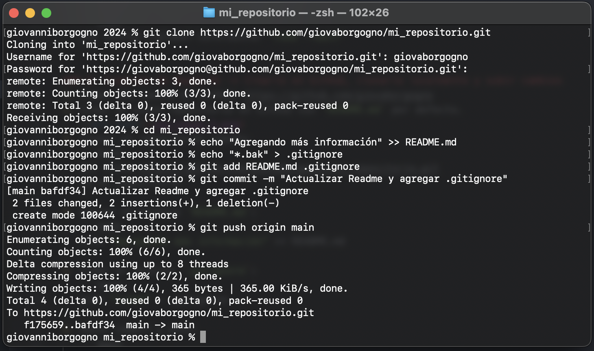

### 5. Creación de Repos 02 -> Crearlo localmente y subirlo a GitHub
1. Crear un repositorio local:
   ```bash
   mkdir nuevo_repositorio
   cd nuevo_repositorio
   git init
   ```
2. Agregar archivo `README.md`:
   ```bash
   echo "# Nuevo Proyecto" > README.md
   ```
3. Crear repositorio en GitHub.
4. Asociar repo local con remoto:
   ```bash
   git remote add origin https://github.com/giovaborgogno/nuevo_repositorio.git
   ```
5. Crear archivo `.gitignore`:
   ```bash
   echo "*.bak" > .gitignore
   ```
6. Hacer commit y push:
   ```bash
   git add README.md .gitignore
   git commit -m "Inicializar repositorio con Readme y .gitignore"
   git push -u origin main
   ```

   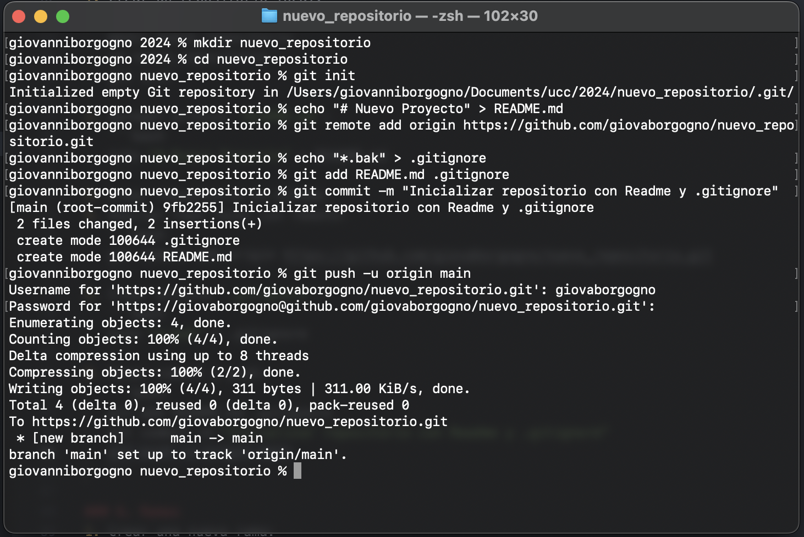

### 6. Ramas
1. Crear una nueva rama:
   ```bash
   git branch nueva_rama
   ```
2. Cambiarse a esa rama:
   ```bash
   git checkout nueva_rama
   ```
3. Hacer un cambio en `README.md` y hacer commit:
   ```bash
   echo "Cambio en la nueva rama" >> README.md
   git add README.md
   git commit -m "Agregar cambios en nueva rama"
   ```
4. Revisar diferencias entre ramas:
   ```bash
   git checkout main
   git diff main nueva_rama
   ```
   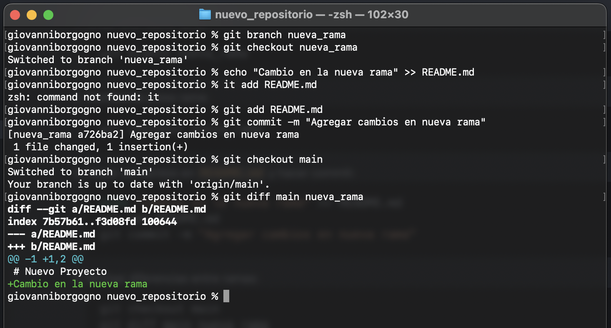

### 7. Merges
1. Hacer un merge FF (fast-forward):
   ```bash
   git merge nueva_rama
   ```
2. Borrar la rama creada:
   ```bash
   git branch -d nueva_rama
   ```
3. Ver el log de commits:
   ```bash
   git log
   ```
   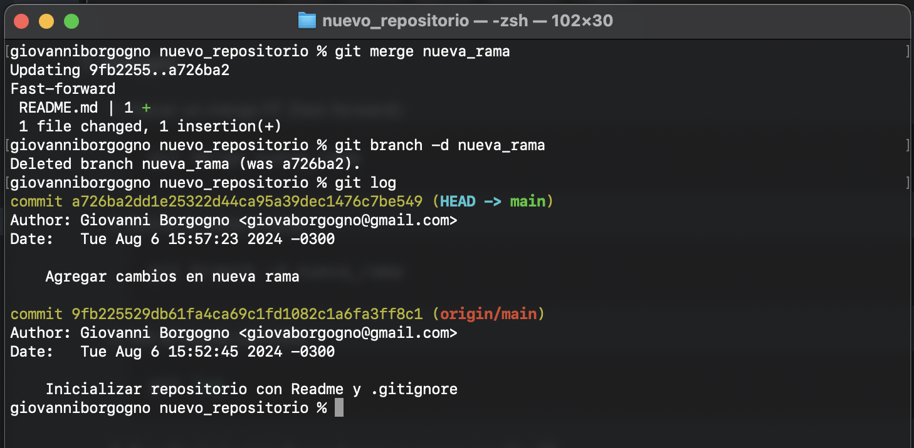

4. Repetir el ejercicio 6 para hacer un merge con No-FF:
   ```bash
   git merge --no-ff nueva_rama
   ```
   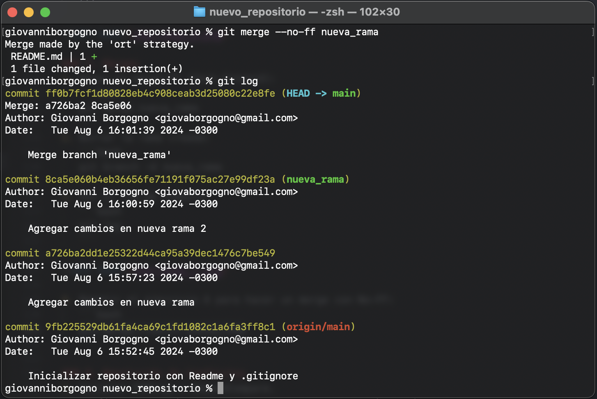

### 8. Resolución de Conflictos
1. Instalar P4Merge o BeyondCompare.
2. Configurar Tortoise/SourceTree para soportar esta herramienta.

   En mi caso uso vscode como difftool y mergetool:

      ```bash
         git config --global diff.tool vscode
         git config --global difftool.vscode.cmd "code --wait --diff \$LOCAL \$REMOTE"
         git config --global merge.tool vscode
         git config --global mergetool.vscode.cmd "code --wait \$MERGED"
      ```
3. Crear una nueva rama conflictBranch:
   ```bash
   git branch conflictBranch
   ```
4. Modificar `README.md` desde `main` y commitear:
   ```bash
   echo "Cambio desde main" >> README.md
   git add README.md
   git commit -m "Modificar Readme desde main"
   ```
5. Modificar la misma línea desde `conflictBranch` y commitear:
   ```bash
   git checkout conflictBranch
   echo "Cambio desde conflictBranch" >> README.md
   git add README.md
   git commit -m "Modificar Readme desde conflictBranch"
   ```
6. Ver diferencias:
   ```bash
   git difftool main conflictBranch
   ```
   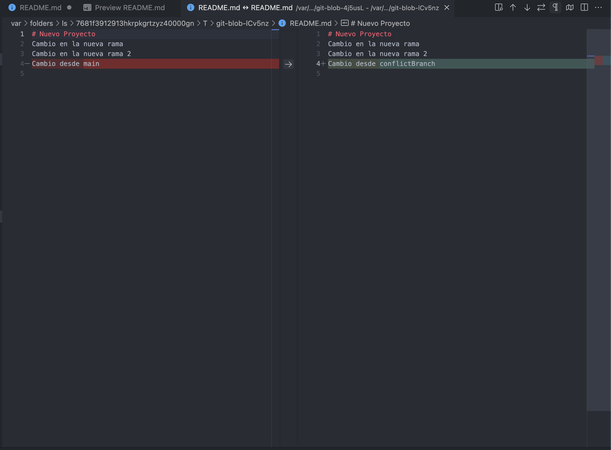
7. Intentar mergear y resolver conflicto:
   ```bash
   git checkout main
   git merge conflictBranch
   git mergetool
   ```
   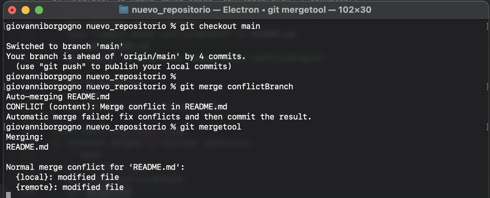
   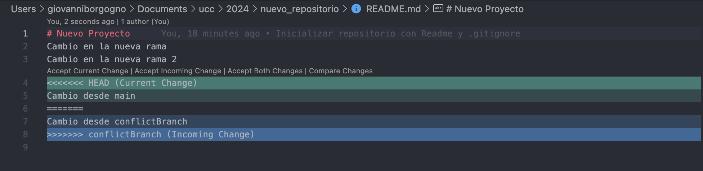


### 9. Familiarizarse con el concepto de Pull Request
1. Explicación: Un pull request es una solicitud para que los que mantinen un repositorio revisen y fusionen los cambios propuestos desde una rama.
2. Crear un branch local y agregar cambios:
   ```bash
   git checkout -b mi_branch
   echo "Cambios en mi_branch" >> README.md
   git add README.md
   git commit -m "Agregar cambios en mi_branch"
   git push origin mi_branch
   ```
3. Crear un pull request en GitHub y completar el proceso de revisión y merge.
   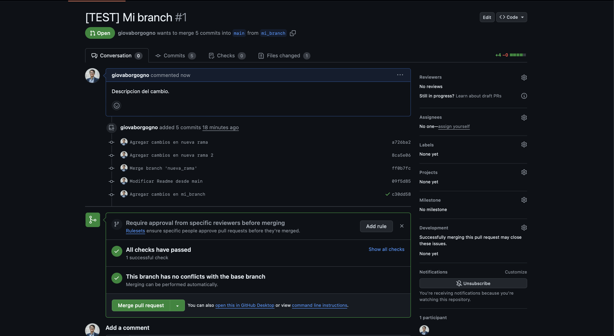
   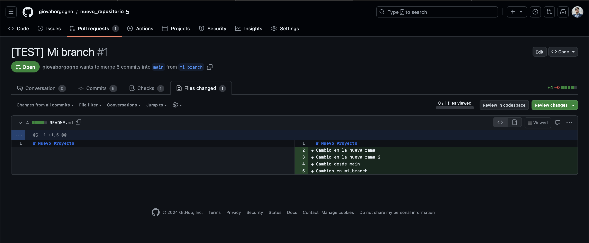
   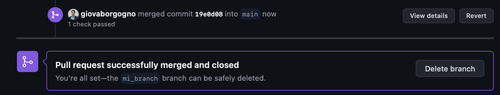

### 10. Algunos ejercicios online
1. Entrar a [Learn Git Branching](https://learngitbranching.js.org/).
2. Completar los ejercicios de Introduction Sequence.
   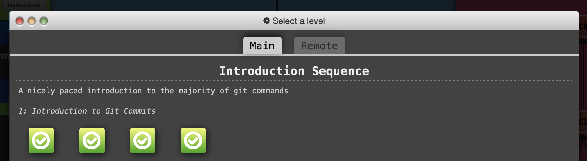
