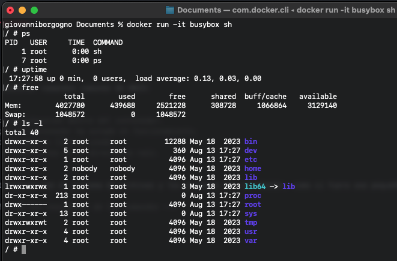

# Trabajo Práctico 2 - Introducción a Docker

## Desarrollo

### 1. Instalar Docker Community Edition


```bash
docker version
```


### 2. Explorar DockerHub

- Registrarse en Docker Hub: [Docker Hub](https://hub.docker.com/).


### 3. Obtener la imagen BusyBox

- BusyBox es una imagen minimalista que incluye versiones simplificadas de muchas utilidades UNIX comunes. Ejecutamos el siguiente comando para bajar la imagen desde DockerHub:

```bash
docker pull busybox
```

- Verificamos qué versión y tamaño tiene la imagen bajada, y obtenemos una lista de imágenes locales con:

```bash
docker images
```

Este comando lista todas las imágenes descargadas en el sistema localmente, junto con detalles como el tamaño y la versión.


### 4. Ejecutando contenedores

- Ejecutamos un contenedor con la imagen BusyBox utilizando el siguiente comando:

```bash
docker run busybox
```

Este comando no produce salida visible porque no se especificó ninguna acción a realizar dentro del contenedor.

- Ahora ejecutamos un comando específico dentro del contenedor:

```bash
docker run busybox echo "Hola Mundo"
```

Este comando ejecuta `echo "Hola Mundo"` dentro del contenedor, lo que devuelve el mensaje "Hola Mundo" en la consola.

```bash
docker ps -a
```

Este comando muestra todos los contenedores que se han ejecutado, incluyendo los que ya no están en ejecución.


### 5. Ejecutando en modo interactivo

```bash
docker run -it busybox sh
```

Dentro del contenedor, podemos ejecutar comandos comunes de UNIX:

```bash
ps        
uptime    
free      
ls -l /   
```




### 6. Borrando contenedores terminados

- Para limpiar contenedores que ya no están en ejecución, primero obtenemos la lista de todos los contenedores con:

```bash
docker ps -a
```

- Luego, borramos contenedores específicos con:

```bash
docker rm <container_id>
```

- Para borrar todos los contenedores que no estén corriendo:

```bash
docker rm $(docker ps -a -q -f status=exited)
```
```bash
docker container prune
```

En mi caso solo eliminaré algunos contenedores especificos porque los otros los uso frecuentemente


### 7. Construir una imagen

- Un Dockerfile es un script que contiene un conjunto de instrucciones para construir una imagen de Docker. Estas instrucciones incluyen:

  - **FROM**: Especifica la imagen base sobre la cual se construirá la nueva imagen.
  - **RUN**: Ejecuta comandos en el contenedor durante la construcción de la imagen.
  - **COPY**/**ADD**: Copian archivos o directorios al sistema de archivos del contenedor.
  - **EXPOSE**: Declara los puertos que la aplicación en el contenedor usará.
  - **CMD**/**ENTRYPOINT**: Especifica qué comando se ejecutará cuando se inicie un contenedor desde la imagen.

- Clonamos el repositorio [SimpleWebAPI](https://github.com/ingsoft3ucc/SimpleWebAPI):

- Explicacion de cada linea del Dockerfile

```Dockerfile
#See https://aka.ms/containerfastmode to understand how Visual Studio uses this Dockerfile to build your images for faster debugging.

FROM mcr.microsoft.com/dotnet/aspnet:7.0 AS base # Esta línea define la imagen base para la etapa base. Utiliza una imagen oficial de ASP.NET Core Runtime versión 7.0 desde el Microsoft Container Registry (MCR).
WORKDIR /app # Establece el directorio de trabajo dentro del contenedor en /app. Todos los comandos subsiguientes se ejecutarán dentro de este directorio.
EXPOSE 80
EXPOSE 443
EXPOSE 5254
# Estas líneas exponen los puertos 80, 443, y 5254, que la aplicación puede usar para HTTP, HTTPS, y cualquier otro servicio que escuche en el puerto 5254. Exponer los puertos no significa que estén automáticamente accesibles desde fuera del contenedor, pero los hace disponibles para mapeo al host cuando se ejecuta el contenedor.

FROM mcr.microsoft.com/dotnet/sdk:7.0 AS build # Aquí se define la etapa build utilizando la imagen oficial de .NET SDK versión 7.0.
WORKDIR /src # Cambia el directorio de trabajo al directorio /src
COPY ["SimpleWebAPI/SimpleWebAPI.csproj", "SimpleWebAPI/"] # Copia el archivo de proyecto SimpleWebAPI.csproj desde el sistema host al contenedor en la ruta SimpleWebAPI/
RUN dotnet restore "SimpleWebAPI/SimpleWebAPI.csproj" # Ejecuta el comando dotnet restore, que descarga todas las dependencias y paquetes necesarios para el proyecto definido en SimpleWebAPI.csproj
COPY . . # Copia todos los archivos desde el directorio actual en el host al directorio actual en el contenedor (/src).
WORKDIR "/src/SimpleWebAPI" # Cambia el directorio de trabajo a /src/SimpleWebAPI
RUN dotnet build "SimpleWebAPI.csproj" -c Release -o /app/build # Compila la aplicación en modo Release y guarda los resultados en el directorio /app/build

FROM build AS publish # Esta línea inicia la etapa publish basada en la etapa anterior build
RUN dotnet publish "SimpleWebAPI.csproj" -c Release -o /app/publish /p:UseAppHost=false # El comando dotnet publish publica la aplicación, guarda el resultado en /app/publish

FROM base AS final # Inicia la etapa final final basada en la etapa base definida anteriormente. Esta es la imagen mínima que se utilizará para ejecutar la aplicación.
WORKDIR /app # Establece nuevamente el directorio de trabajo en /app.
COPY --from=publish /app/publish . # Copia los archivos publicados desde la etapa publish al directorio de trabajo actual /app en la etapa final. Esto significa que solo los archivos necesarios para ejecutar la aplicación están presentes en la imagen final.
ENTRYPOINT ["dotnet", "SimpleWebAPI.dll"] # Define el punto de entrada para el contenedor. Esto indica que cuando se ejecute el contenedor, se iniciará el comando dotnet SimpleWebAPI.dll, que ejecutará la aplicación.
#CMD ["/bin/bash"] # Esta línea está comentada, pero si estuviera activa, se utilizaría para iniciar un bash shell en lugar de ejecutar la aplicación, lo que podría ser útil para debuguear.
```

- Construimos la imagen

```bash
docker build -t mywebapi .
```

- Subimos la imagen a Docker Hub

```bash
docker login
```

```bash
docker tag mywebapi giovaborgogno/mywebapi:latest
```

```bash
docker push giovaborgogno/mywebapi:latest
```

```bash
docker pull giovaborgogno/mywebapi:latest # Para verificar que esta subida correctamente
```


### 8. Publicando puertos

- Para ejecutar un contenedor de nuestra imagen y exponer puertos para acceso externo, utilizamos:

```bash
docker run --name myapi -d -p 80:80 mywebapi
```

Esto mapea el puerto 80 del contenedor en el puerto 80 de la máquina host, permitiendo el acceso a la aplicación desde un navegador web.


### 9. Modificar Dockerfile para soportar bash

- Modificamos el Dockerfile para permitir que el contenedor se inicie en bash sin ejecutar automáticamente la aplicación:

```Dockerfile
# ENTRYPOINT ["dotnet", "SimpleWebAPI.dll"]
CMD ["/bin/bash"]
```

- Rehacemos la imagen con:

```bash
docker build -t mywebapi .
```

- Corremos el contenedor en modo interactivo con:

```bash
docker run -it --rm -p 80:80 mywebapi
```

Esto nos permite ejecutar comandos manualmente dentro del contenedor antes de iniciar la aplicación.


### 10. Montando volúmenes

- Montar un volumen permite compartir directorios entre el host y el contenedor. Ejecutamos el siguiente comando para montar un volumen:

```bash
docker run -it --rm -p 80:80 -v ./.temp:/var/temp mywebapi
```

Dentro del contenedor, podemos verificar el contenido del volumen montado:

```bash
ls -l /var/temp
touch /var/temp/hola.txt
```

Estos comandos permiten crear y verificar archivos dentro del volumen compartido, lo que demuestra cómo el contenedor puede interactuar con el sistema de archivos del host.


### 11. Utilizando una base de datos

- Para utilizar una base de datos PostgreSQL en Docker, levantamos un contenedor con:

```bash
docker run --name my-postgres -e POSTGRES_PASSWORD=mysecretpassword -v $HOME/.postgres:/var/lib/postgresql/data -p 5434:5432 -d postgres:9.4 # En mi caso uso el puerto 5434 porque el 5432 ya lo tengo en uso
```

Este comando inicia un contenedor PostgreSQL con persistencia de datos y acceso desde el host.

- Nos conectamos al contenedor y ejecutamos comandos SQL:

```bash
docker exec -it my-postgres /bin/bash
psql -h localhost -U postgres
```

Dentro de PostgreSQL, podemos crear y manipular bases de datos y tablas.

```sql
CREATE DATABASE test;
\connect test
CREATE TABLE tabla_a (mensaje VARCHAR(50));
INSERT INTO tabla_a (mensaje) VALUES('Hola mundo!');
SELECT * FROM tabla_a;
```

Estos comandos muestran cómo interactuar con una base de datos dentro de un contenedor Docker.


- `docker run`: Este comando se utiliza para crear y ejecutar un nuevo contenedor a partir de una imagen especificada. En el contexto del ejercicio, docker run fue utilizado para iniciar un contenedor de PostgreSQL con la configuración necesaria para que la base de datos esté disponible en el puerto 5434, permitiendo la persistencia de datos mediante el uso de volúmenes. Este comando también configura variables de entorno, como la contraseña del usuario postgres.
- `docker exec`: Este comando se utiliza para ejecutar un comando dentro de un contenedor que ya está en ejecución. En este caso, docker exec fue utilizado para abrir una sesión interactiva dentro del contenedor PostgreSQL, permitiendo ejecutar comandos de la base de datos directamente en la instancia de PostgreSQL que está corriendo en el contenedor. Esto permite administrar la base de datos, realizar consultas, y ejecutar otras tareas de mantenimiento directamente desde el entorno del contenedor.

- Interaccion desde DBeaver


### 12. Hacer el punto 11 con Microsoft SQL Server

- Similar al ejercicio con PostgreSQL, podemos levantar un contenedor con Microsoft SQL Server, crear bases de datos y ejecutar consultas SQL. (En mi caso la imagen de sql server no funciona en Mac M1, entonces use la que provee Azure)

```bash
docker run --cap-add SYS_PTRACE --name my-sqlserver -e 'ACCEPT_EULA=1' -e 'MSSQL_SA_PASSWORD=myStrong!Password' -p 1433:1433 -v ./.sqlvolume:/var/opt/mssql -d mcr.microsoft.com/azure-sql-edge
```


sqlcmd tool no esta disponible para arquitecturas ARM64: `sqlcmd tool is not available inside the ARM64 version of SQL Edge containers.`  https://hub.docker.com/r/microsoft/azure-sql-edge . 

Pero se usaría de esta forma: 

```bash
docker exec -it my-sqlserver /opt/mssql-tools/bin/sqlcmd -S localhost -U sa -P 'myStrong!Password'
```
Directamente conecto la instancia con DBeaver y ejecuto las consultas a la base de datos


