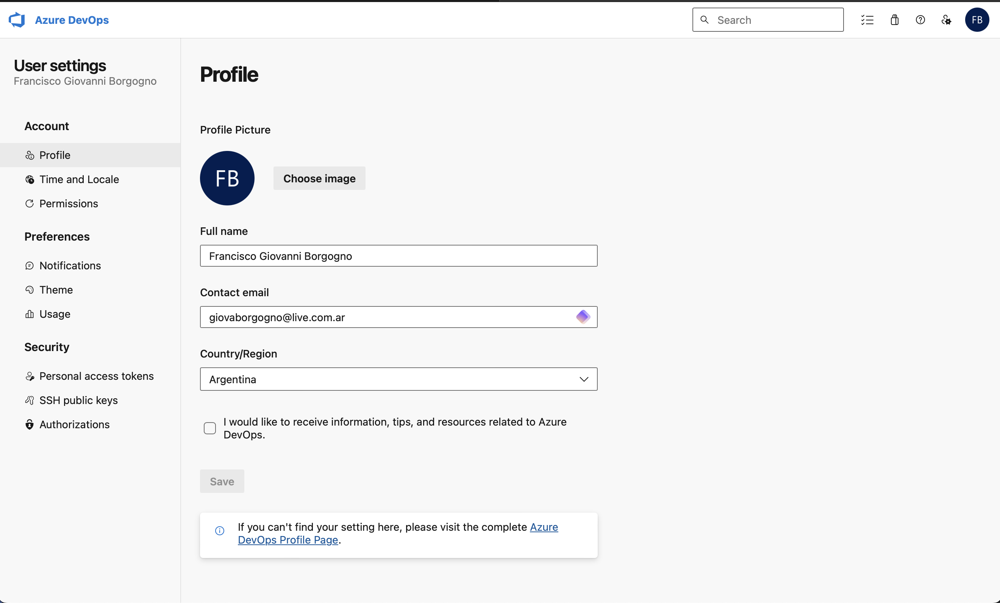
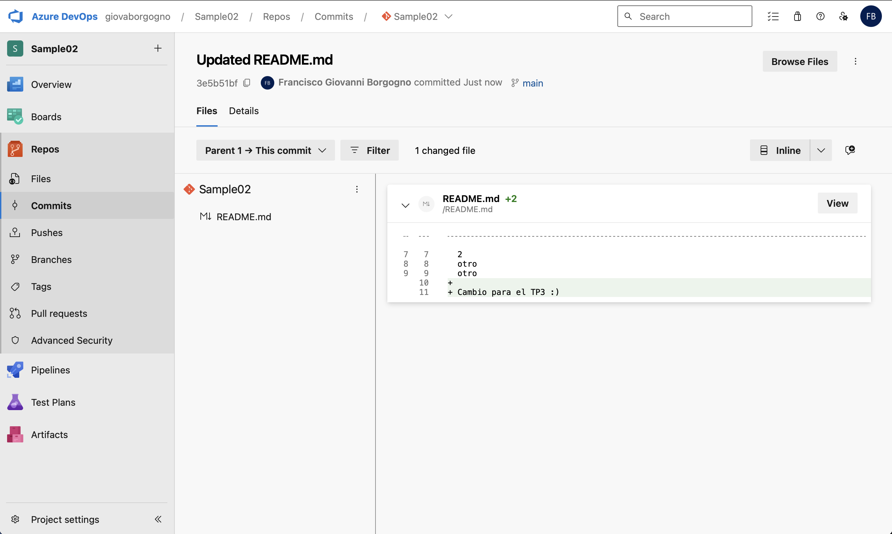
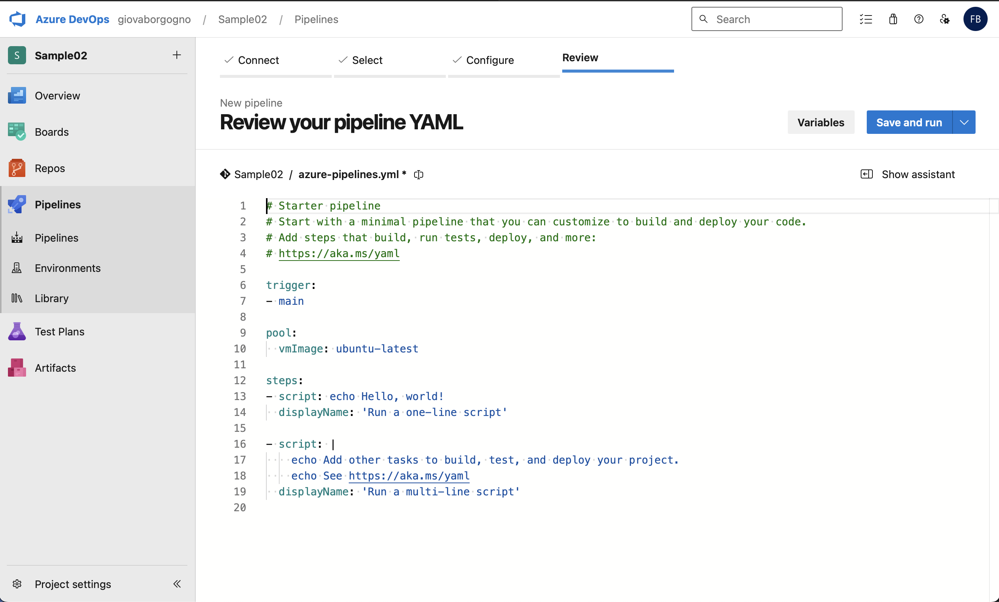

# Trabajo Práctico 3 - Introducción a Azure DevOps

## 1. Objetivos de Aprendizaje

Familiarizarse con la plataforma Azure DevOps.

## 2. Consignas a desarrollar en el trabajo práctico

### 2.1 ¿Qué es Azure DevOps?

Azure DevOps es un conjunto de herramientas que facilita la colaboración en el desarrollo de software. Proporciona servicios para gestionar el ciclo de vida completo de las aplicaciones, desde la planificación y el desarrollo hasta la entrega y operación.

### 2.2 Beneficios de utilizar Azure DevOps en comparación con otras soluciones

- **Integración Completa**: Ofrece una suite de herramientas que cubren todo el ciclo de vida de desarrollo de software en una sola plataforma.
- **Escalabilidad**: Adecuado tanto para proyectos pequeños como para grandes organizaciones.
- **Flexibilidad**: Integración con una amplia gama de herramientas de terceros y soporte para diferentes lenguajes de programación y plataformas.
- **Automatización**: Soporte robusto para CI/CD que permite la automatización de las pruebas, la compilación y la implementación.

Azure DevOps se integra fácilmente con herramientas populares como GitHub, Jenkins, Docker, y Kubernetes. También cuenta con un Marketplace de extensiones que permite añadir funcionalidades adicionales según las necesidades del proyecto.

## 3. Pasos del TP

### 3.1 Crear una cuenta en Azure DevOps

### 3.2 Crear un proyecto Sample01

### 3.3 Crear un repo GIT desde cero

### 3.4 Crear un proyecto Sample02

### 3.5 Importar un repo desde GitHub: https://github.com/ingsoft3ucc/SimpleWebAPI.git

### 3.6 Realizar un cambio en un archivo, y subirlo al repo de ADO.

### 3.7 Crear un pipeline, solicitar acceso a jobs de paralelismo

### 3.8 Cambiar el tipo de proceso de Basic a Agile

### 3.8 Crear un sprint

### 3.9 Crear User Stories

### 3.10 Crear Tasks y Bugs
