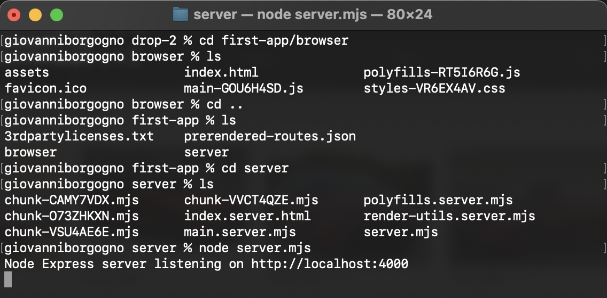

# Trabajo Práctico 4 - Azure Devops Pipelines

## 4. Pasos del TP

### 4.1 Verificar acceso a Pipelines concedido

### 4.2 Agregar en pipeline YAML una tarea de Publish.

### 4.3 Explicar por qué es necesario contar con una tarea de Publish en un pipeline que corre en un agente de Microsoft en la nube.
La tarea de Publish en un pipeline es necesaria porque permite almacenar y compartir los artefactos compilados, como archivos ejecutables o paquetes listos para ser distribuidos. Cuando el pipeline corre en un agente de Microsoft en la nube, después de compilar el código, necesitamos asegurarnos de que el resultado esté disponible para otros pasos del pipeline o para descargarlo después de la ejecución. Publicar los artefactos facilita su acceso y uso en entornos como producción o testing.

### 4.4 Descargar el resultado del pipeline y correr localmente el software compilado.

### 4.5 Habilitar el editor clásico de pipelines. Explicar las diferencias claves entre este tipo de editor y el editor YAML.
- Editor Clásico: Es una interfaz visual donde podés armar el pipeline arrastrando y configurando tareas sin necesidad de escribir código. Es más fácil de usar para quienes no están familiarizados con YAML, pero tiene menos flexibilidad.
- Editor YAML: Requiere escribir el pipeline en un archivo de texto, lo que permite mayor control y personalización. Además, el pipeline queda guardado como parte del código del proyecto, lo que es más conveniente para colaborar y versionar los cambios.

### 4.6 Crear un nuevo pipeline con el editor clásico. Descargar el resultado del pipeline y correr localmente el software compilado.

### 4.7 Configurar CI en ambos pipelines (YAML y Classic Editor). Mostrar resultados de la ejecución automática de ambos pipelines al hacer un commit en la rama main.

### 4.8 Explicar la diferencia entre un agente MS y un agente Self-Hosted. Qué ventajas y desventajas hay entre ambos? Cuándo es conveniente y/o necesario usar un Self-Hosted Agent?
- Agente MS (Microsoft-hosted): Es un agente administrado por Microsoft, lo cual significa que no tenés que preocuparte por su instalación ni mantenimiento. Está listo para usar, pero tiene limitaciones en cuanto a tiempo y recursos, y no tenés control total sobre él.
- Agente Self-Hosted: Es un agente que configurás y corrés en tus propios servidores o computadoras. Te da control total sobre el entorno (podés instalar lo que quieras), y es útil si necesitás más poder de procesamiento o querés evitar las limitaciones de los agentes de Microsoft. Sin embargo, requiere que lo mantengas y te asegures de que esté disponible cuando el pipeline lo necesite.

### 4.8 Crear un Pool de Agentes y un Agente Self-Hosted

### 4.9 Instalar y correr un agente en nuestra máquina local.

### 4.10 Crear un pipeline que use el agente Self-Hosted alojado en nuestra máquina local.

### 4.11 Buscar el resultado del pipeline y correr localmente el software compilado.

### 4.12 Crear un nuevo proyecto en ADO clonado desde un repo que contenga una aplicación en Angular como por ejemplo https://github.com/ingsoft3ucc/angular-demo-project.git

### 4.13 Configurar un pipeline de build para un proyecto de tipo Angular como el clonado.

### 4.14 Habilitar CI para el pipeline.
Ya le puse el trigger para cuando se haga un push a main.

### 4.15 Hacer un cambio a un archivo del proyecto (algún cambio en el HTML que se renderiza por ejemplo) y verificar que se ejecute automáticamente el pipeline.

### 4.16 Descargar el resultado del pipeline y correr en un servidor web local el sitio construido.

### 4.17 Mostrar el antes y el después del cambio.
Antes:

Despues:

