## Trabajo Práctico 5 - Despliegue de aplicaciones con Azure Devops Release Pipelines

### 1- Objetivos de Aprendizaje
 - Adquirir conocimientos acerca de las herramientas de despliegue y releases de aplicaciones.
 - Configurar este tipo de herramientas.
 - Comprender el concepto de recurso en Azure
 - Comprender los conceptos básicos de Release Pipelines en Azure DevOps.
 - Configurar un Release Pipeline para automatizar despliegues en diferentes entornos-

### 2- Unidad temática que incluye este trabajo práctico
Este trabajo práctico corresponde a la unidad Nº: 3 (Libro Continuous Delivery: Cap 10)

### 3- Consignas a desarrollar en el trabajo práctico:
 - Los despliegues (deployments) de aplicaciones se pueden realizar en diferentes tipos de entornos
   - On-Premise (internos) es decir en servidores propios.
   - Nubes Públicas, ejemplo AWS, Azure, Gcloud, etc.
   - Plataformas como servicios (PaaS), ejemplo Heroku, Google App Engine, AWS, Azure WebApp, etc
 - En este práctico haremos despliegue a Plataforma como Servicio utilizando Azure Web Apps

### 4- Desarrollo:
4.1\. Crear una cuenta en Azure
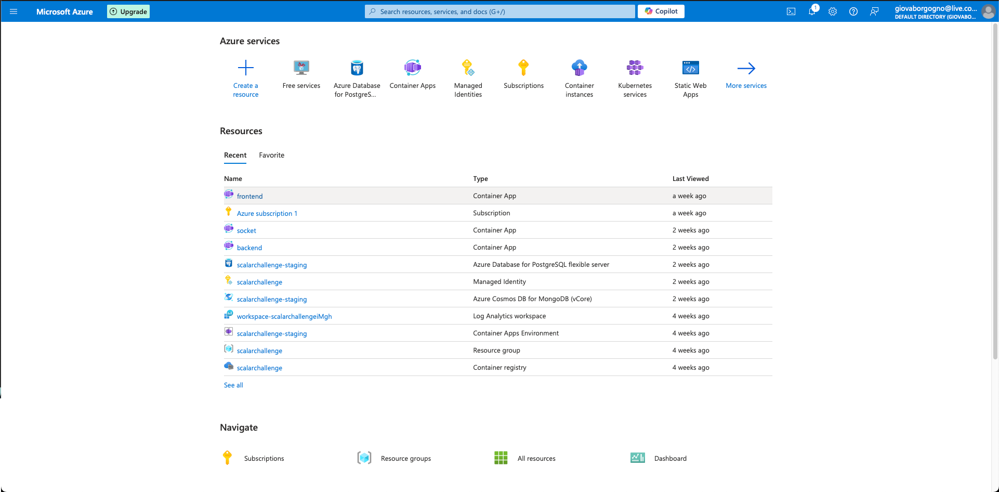

4.2\. Crear un recurso Web App en Azure Portal y navegar a la url provista
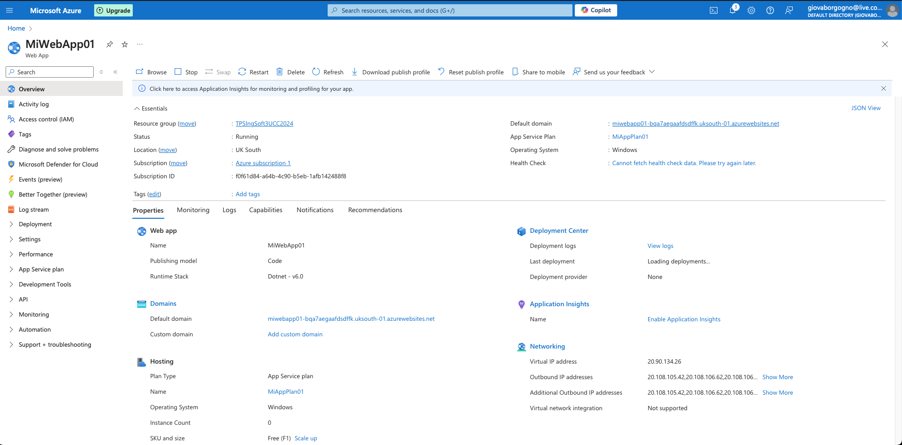
https://miwebapp01-bqa7aegaafdsdffk.uksouth-01.azurewebsites.net
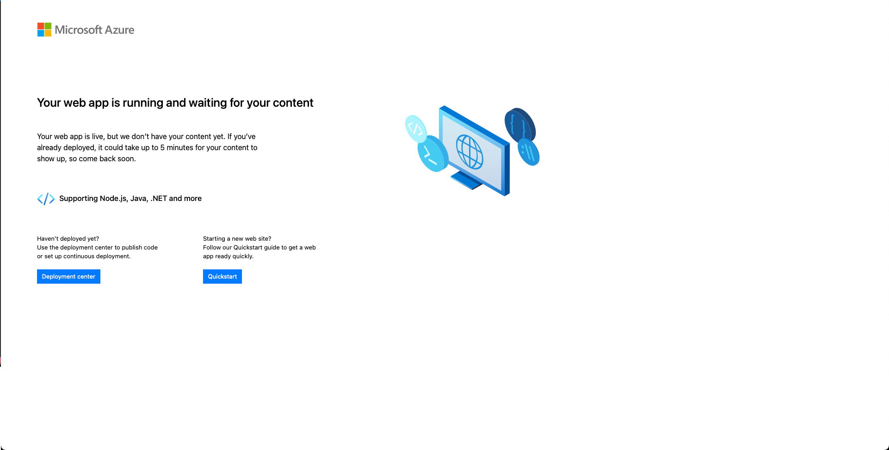

4.3\. Actualizar Pipeline de Build para que use tareas de DotNetCoreCLI@2 como en el pipeline clásico, luego crear un Pipeline de Release en Azure DevOps con CD habilitada
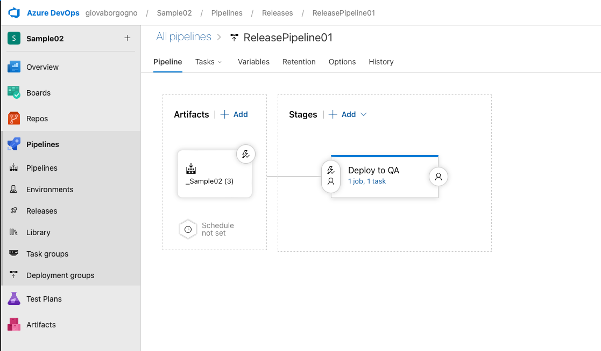


4.4\. Optimizar Pipeline de Build

https://dev.azure.com/giovaborgogno/_git/Sample02?path=/build.yml

4.5\. Verificar el deploy en la url de la WebApp /weatherforecast
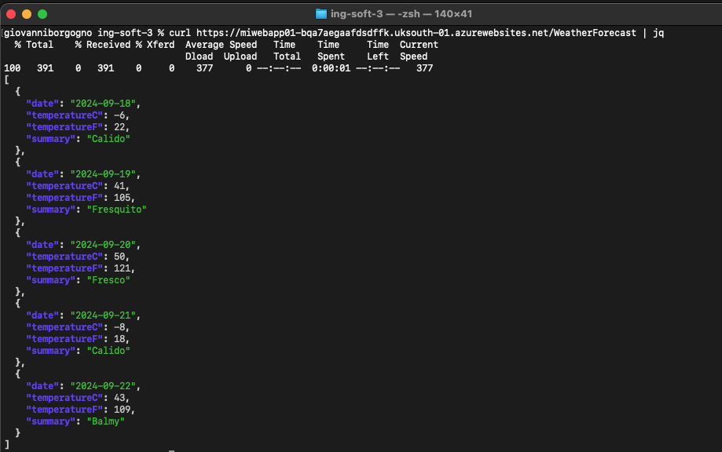

4.6\. Realizar un cambio al código del controlador para que devuelva 7 pronósticos, realizar commit, evaluar ejecución de pipelines de build y release, navegar a la url de la webapp/weatherforecast y corroborar cambio
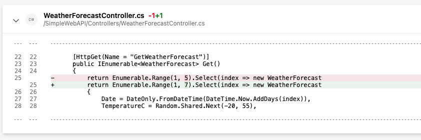
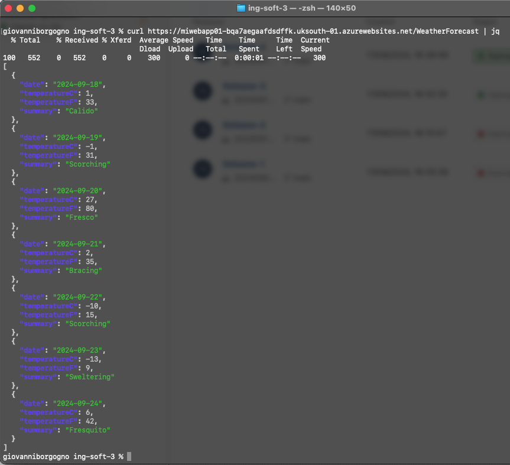

4.7\. Clonar la Web App de QA para que contar con una WebApp de PROD a partir de un Template Deployment en Azure Portal y navegar a la url provista para la WebApp de PROD.
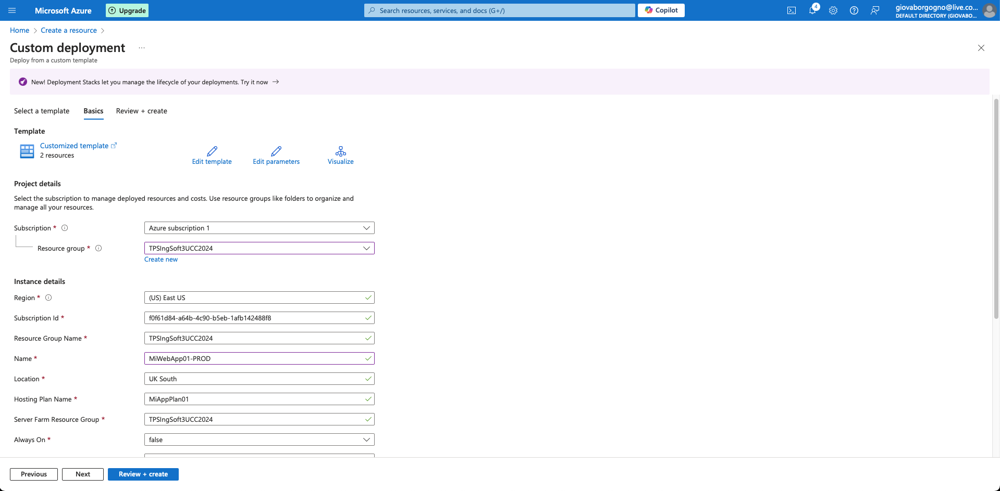
https://miwebapp01-prod-cugvhzdhbeb2gxg2.uksouth-01.azurewebsites.net

4.8\. Agregar una etapa de Deploy a Prod en Azure Release Pipelines 
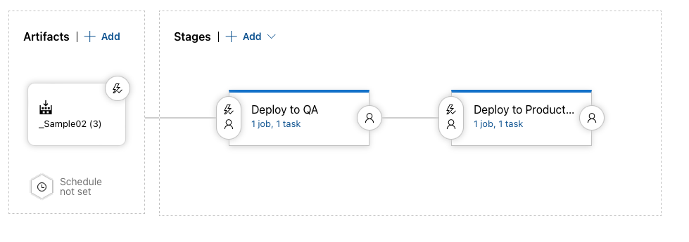

4.9\.  Realizar un cambio al código del controlador para que devuelva 10 pronósticos, realizar commit, evaluar ejecución de pipelines de build y release, navegar a la url de la webapp/weatherforecast y corroborar cambio, verificar que en la url de la webapp_prod/weatherforecast se muestra lo mismo.
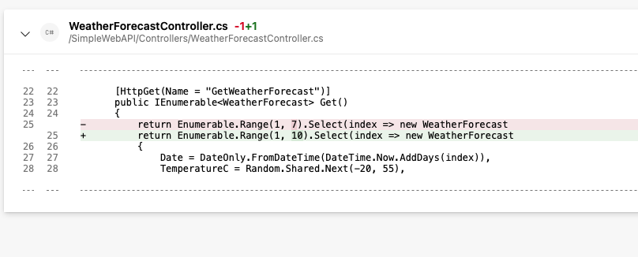
QA:
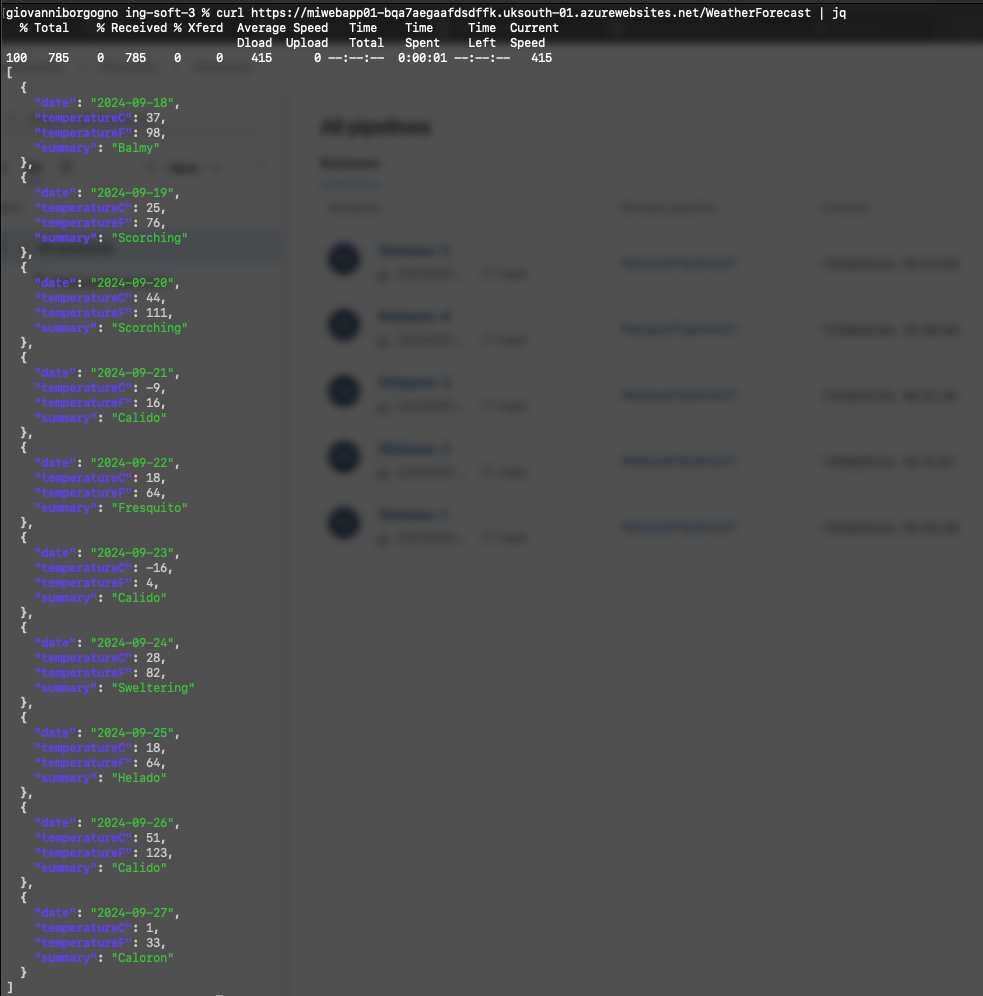
PRDUCTION:
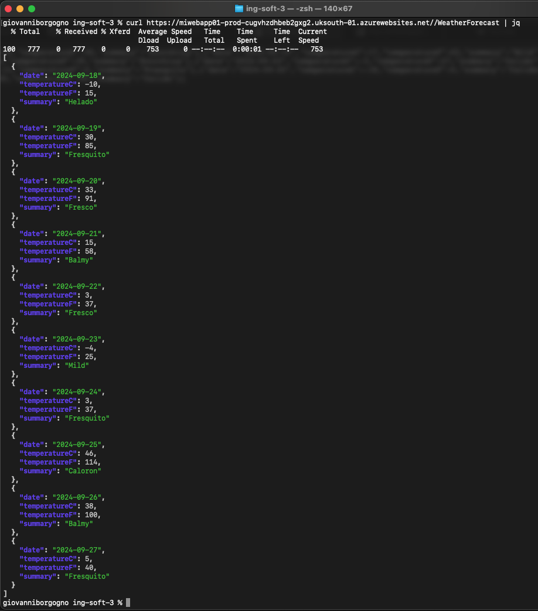

4.10\. Modificar pipeline de release para colocar una aprobación manual para el paso a Producción.
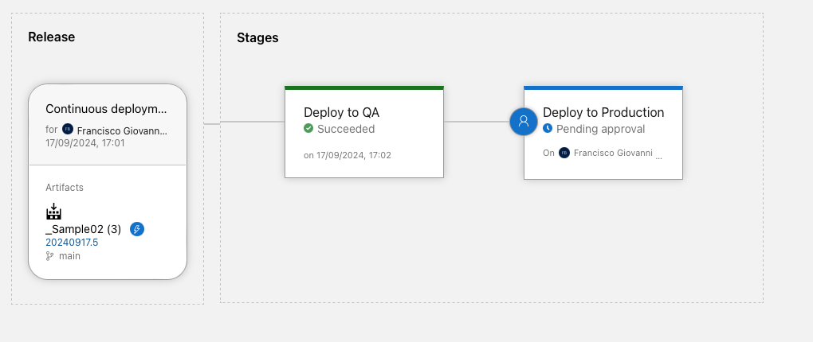

4.11\. Realizar un cambio al código del controlador para que devuelva 5 pronósticos, realizar commit, evaluar ejecución de pipelines de build y release, navegar a la url de la webapp/weatherforecast y corroborar cambio, verificar que en la url de la webapp_prod/weatherforecast aun se muestra la versión anterior.

QA:
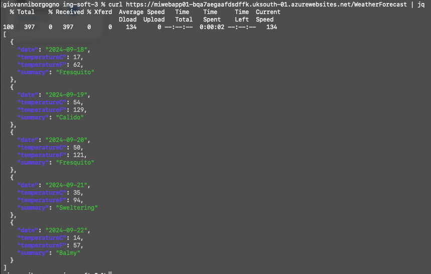
PRODUCITON
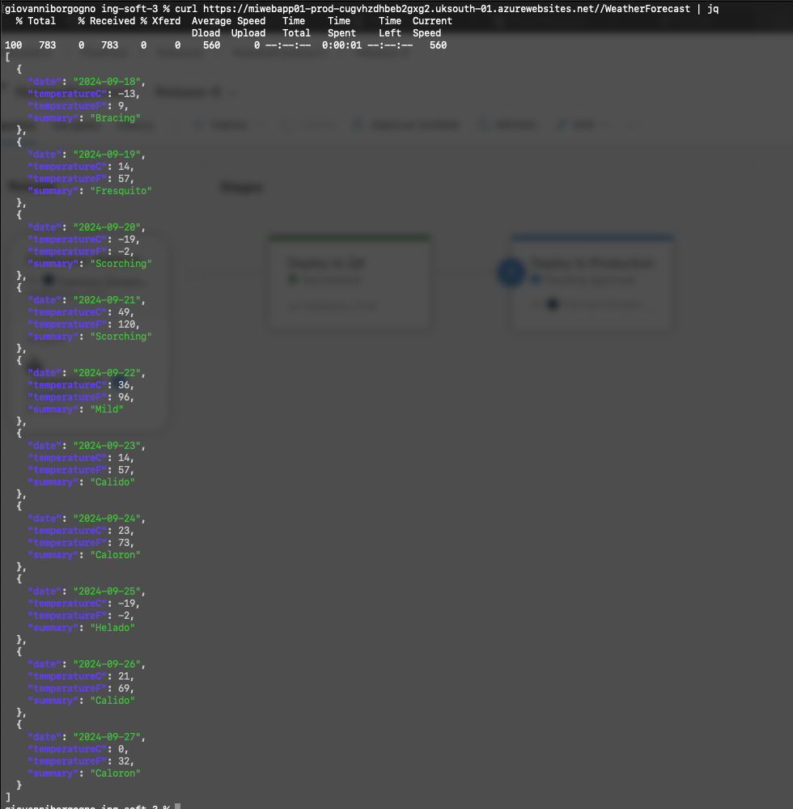

4.12\. Aprobar el pase ya sea desde el release o desde el mail recibido. 
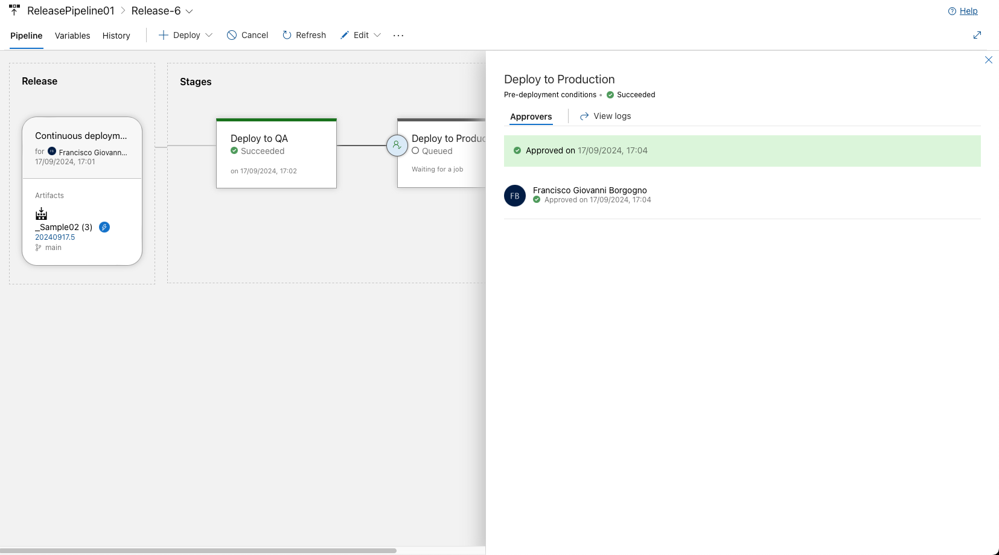

4.13\. Esperar a la finalización de la etapa de Pase a Prod y luego corroborar que en la url de la webapp_prod/weatherforecast se muestra la nueva versión coinicidente con la de QA.
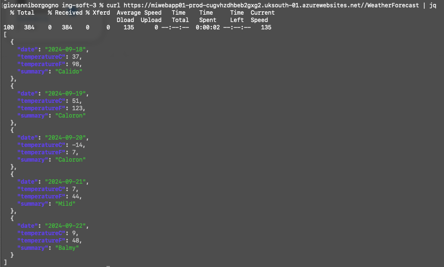

4.14\. Realizar un pipeline (no release) que incluya el deploy a QA y a PROD con una aprobación manual. El pipeline debe estar construido en YAML sin utilizar el editor clásico de pipelines ni el editor clásico de pipelines de release.
 
 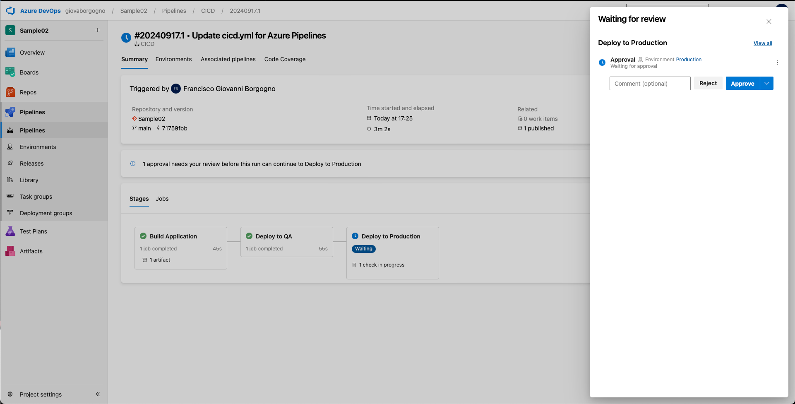

https://dev.azure.com/giovaborgogno/_git/Sample02?path=/cicd.yml
```yml
trigger:
- main

pool:
  vmImage: 'ubuntu-latest'

variables:
  solution: 'SimpleWebAPI.sln'
  buildPlatform: 'Any CPU'
  buildConfiguration: 'Release'
  ConnectedServiceName: 'Azure subscription 1 (f0f61d84-a64b-4c90-b5eb-1afb142488f8)' # Subscription ID
  WebAppKind: 'webApp'
  QAWebAppName: 'MiWebApp01' # QA WebApp name
  ProdWebAppName: 'MiWebApp01-PROD' # Production WebApp name

stages:
- stage: Build
  displayName: 'Build Application'
  jobs:
  - job: Build
    displayName: 'Build Application'
    steps:
      - task: UseDotNet@2
        inputs:
          packageType: sdk
          version: '7.x'  # Use the correct version of .NET
          installationPath: $(Agent.ToolsDirectory)/dotnet

      - script: |
          echo "Current directory: $(Build.SourcesDirectory)"
          cd $(Build.SourcesDirectory)
          ls -l
          dotnet restore $(solution)
        displayName: 'Restore NuGet Packages'

      - script: |
          dotnet build $(solution) --configuration $(buildConfiguration)
        displayName: 'Build Project'

      - script: |
          dotnet test $(solution) --configuration $(buildConfiguration)
        displayName: 'Run Unit Tests'

      - script: |
          dotnet publish $(solution) --configuration $(buildConfiguration) --output $(Build.ArtifactStagingDirectory) --no-build
        displayName: 'Publish Project'
      
      - task: PublishBuildArtifacts@1
        inputs:
          pathToPublish: '$(Build.ArtifactStagingDirectory)'
          artifactName: 'drop'
          publishLocation: 'Container'
        displayName: 'Publish Build Artifacts'

- stage: DeployToQA
  displayName: 'Deploy to QA'
  dependsOn: Build
  condition: succeeded()
  jobs:
  - deployment: DeployToQA
    displayName: 'Deploy to QA'
    environment: 'QA'
    strategy:
      runOnce:
        deploy:
          steps:
            - task: DownloadPipelineArtifact@2
              displayName: 'Download Build Artifacts'
              inputs:
                buildType: 'current'
                artifactName: 'drop'
                targetPath: '$(Pipeline.Workspace)/drop'

            - script: ls -l "$(Pipeline.Workspace)/drop"
              displayName: 'List Pipeline Workspace Content (QA)'

            - task: AzureRmWebAppDeployment@4
              displayName: 'Deploy to Azure App Service (QA)'
              inputs:
                azureSubscription: '$(ConnectedServiceName)'
                appType: 'webApp'
                WebAppName: '$(QAWebAppName)'
                package: '$(Pipeline.Workspace)/drop'

- stage: DeployToProd
  displayName: 'Deploy to Production'
  dependsOn: DeployToQA
  condition: succeeded()
  jobs:
  - deployment: DeployToProd
    displayName: 'Deploy to Production'
    environment: 'Production'
    strategy:
      runOnce:
        deploy:
          steps:
            - task: DownloadPipelineArtifact@2
              displayName: 'Download Build Artifacts'
              inputs:
                buildType: 'current'
                artifactName: 'drop'
                targetPath: '$(Pipeline.Workspace)/drop'

            - script: ls -l "$(Pipeline.Workspace)/drop"
              displayName: 'List Pipeline Workspace Content (Production)'

            - task: AzureRmWebAppDeployment@4
              displayName: 'Deploy to Azure App Service (Production)'
              inputs:
                azureSubscription: '$(ConnectedServiceName)'
                appType: 'webApp'
                WebAppName: '$(ProdWebAppName)'
                package: '$(Pipeline.Workspace)/drop'
```

