## Trabajo Práctico 6 - Pruebas Unitarias

### Desarrollo:

#### 4.1 Creación de una BD SQL Server para nuestra App
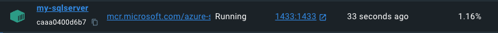

#### 4.2 Obtener nuestra App

A\. Clonar el repo https://github.com/ingsoft3ucc/Angular_WebAPINetCore8_CRUD_Sample.git

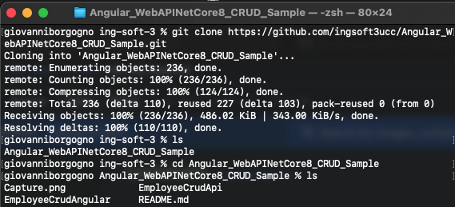

B\. Seguir las instrucciones del README.md del repo clonado prestando atención a la modificación de la cadena de conexión en el appSettings.json para que apunte a la BD creada en 4.1

```json
{
 "ConnectionStrings": {
    "DefaultConnection": "Server=localhost,1433;Initial Catalog=master;Persist Security Info=False;User ID=sa;Password=myStrong!Password;MultipleActiveResultSets=False;Encrypt=True;TrustServerCertificate=True;Connection Timeout=30;"
  }
}
```

C\. Navegar a http://localhost:7150/swagger/index.html y probar uno de los controladores para verificar el correcto funcionamiento de la API.

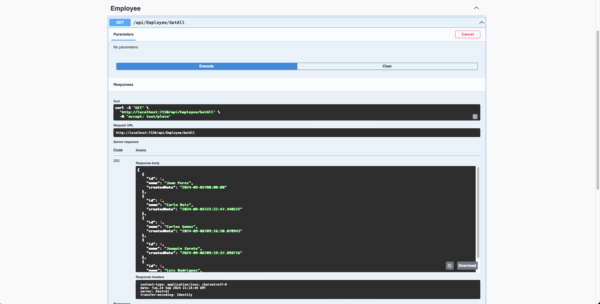

D\. Navegar a http://localhost:4200 y verificar el correcto funcionamiento de nuestro front-end Angular

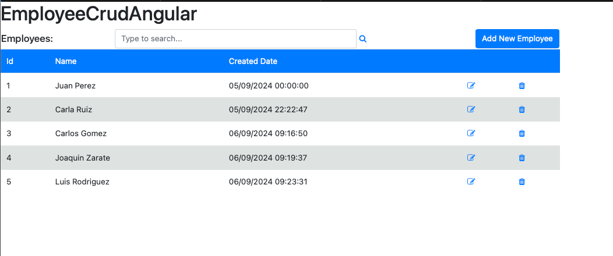


#### 4.3 Crear Pruebas Unitarias para nuestra API

A\. En el directorio raiz de nuestro repo crear un nuevo proyecto de pruebas unitarias para nuestra API

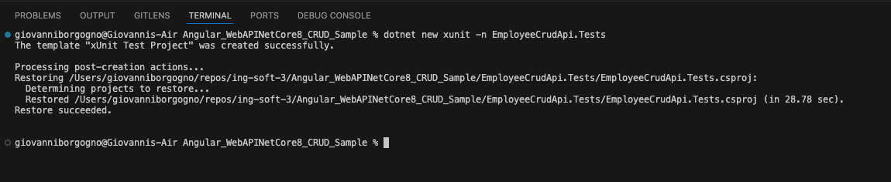

B\. Instalar dependencias necesarias

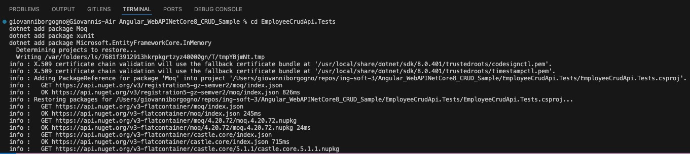

C\. Editar archivo UnitTest1.cs reemplazando su contenido por

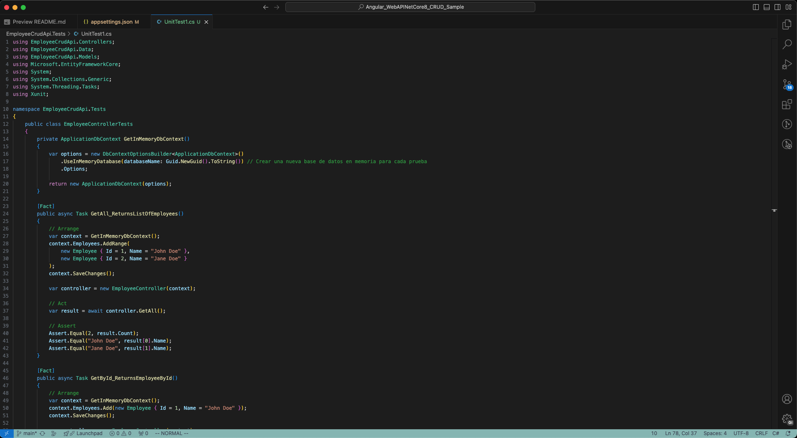

D\. Renombrar archivo UnitTest1.cs por EmployeeControllerUnitTests.cs

```bash
mv UnitTest1.cs EmployeeControllerUnitTests.cs 
```

E\. Editar el archivo EmployeeCrudApi.Tests/EmployeeCrudApi.Tests.csproj para agregar una referencia a nuestro proyecto de EmployeeCrudApi reemplazando su contenido por

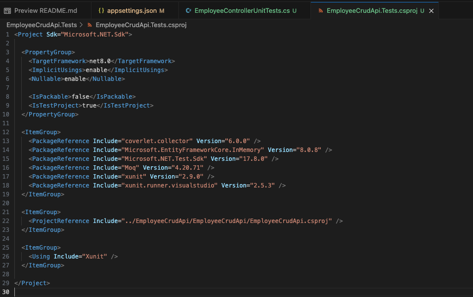

F\. Ejecutar los siguientes comandos para ejecutar nuestras pruebas

```
dotnet build
dotnet test
```

G\. Verificar que se hayan ejecutado correctamente las pruebas

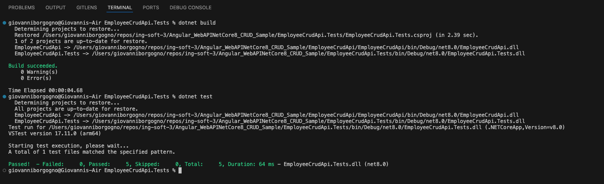

H\. Verificar que no estamos usando una dependencia externa como la base de datos.

I\. Modificar la cadena de conexión en el archivo appsettings.json para que use un usuario o password incorrecto y recompilar el proyecto EmployeeCrudApi. En mi caso detuve el contenedor.

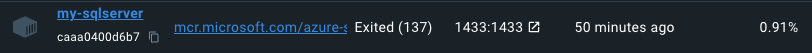

J\. Verificar que nuestro proyecto ya no tiene acceso a la BD navegando a http://localhost:7150/swagger/index.html y probando uno de los controladores:

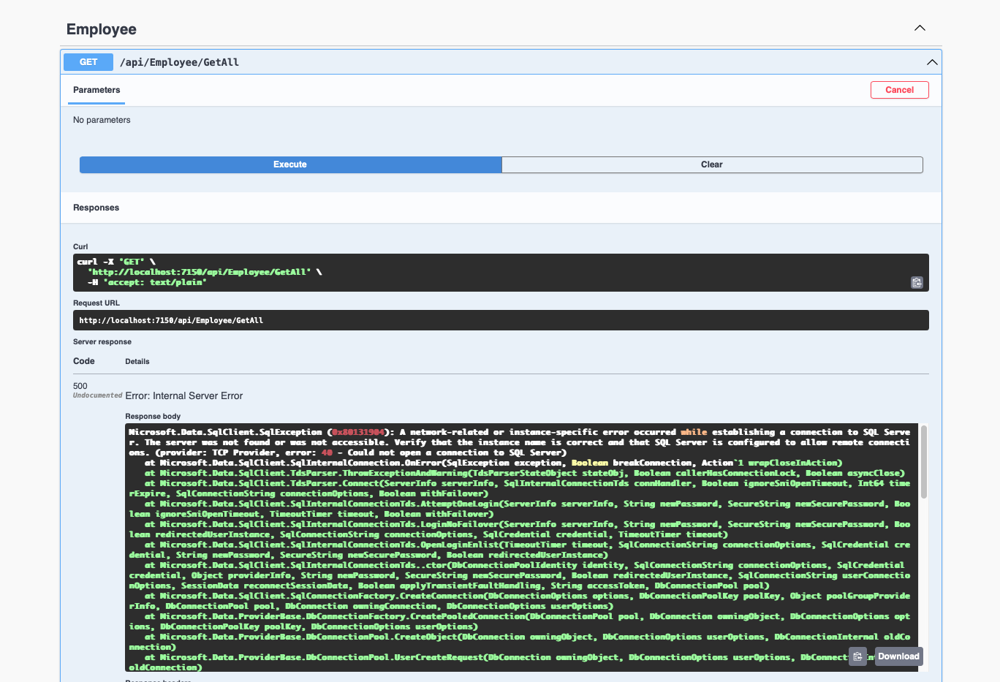

K\. En la carpeta de nuestro proyecto EmployeeCrudApi.Tests volver a correr las pruebas

L\. Verificar que se hayan ejecutado correctamente las pruebas inclusive sin tener acceso a la BD, lo que confirma que es efectivamente un conjunto de pruebas unitarias que no requieren de una dependencia externa para funcionar.

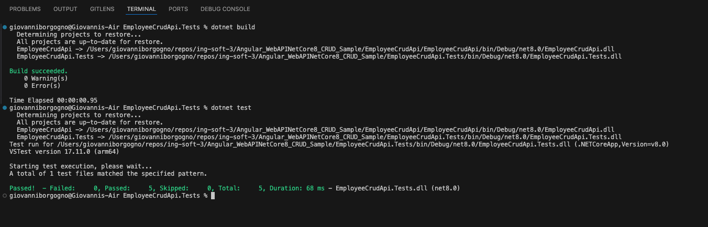

M\. Modificar la cadena de conexión en el archivo appsettings.json para que use el usuario y password correcto y recompilar el proyecto EmployeeCrudApi

N\. Verificar que nuestro proyecto vuelve a tener acceso a la BD navegando a http://localhost:7150/swagger/index.html y probando uno de los controladores:

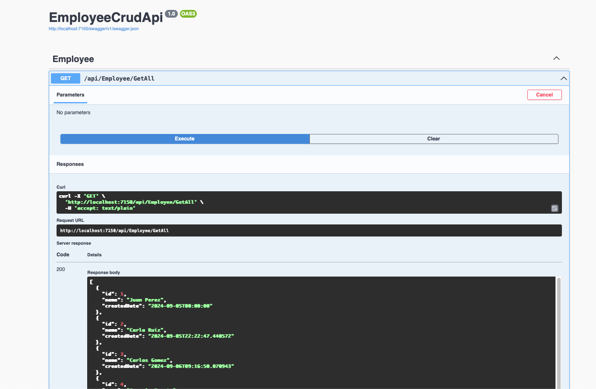

#### 4.4 Creamos pruebas unitarias para nuestro front de Angular:

A\. Nos posicionamos en nuestro proyecto de front, en el directorio EmployeeCrudAngular/src/app

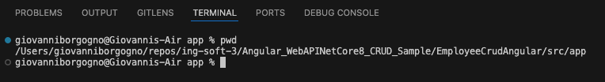

B\. Editamos el archivo app.component.spec.ts reemplazando su contenido por:

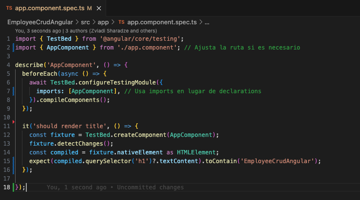

C\. Creamos el archivo employee.service.spec.ts reemplazando su contenido por:

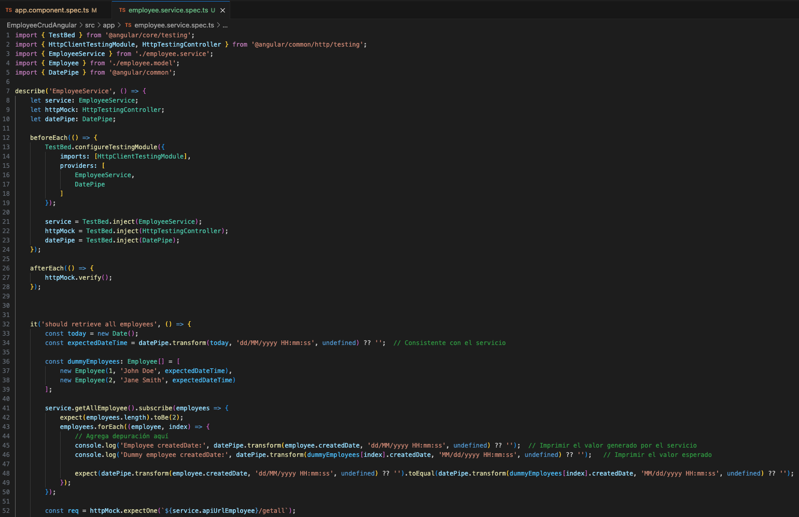

D\. Editamos el archivo employee.component.spec.ts ubicado en la carpeta **employee** reemplazando su contenido por:

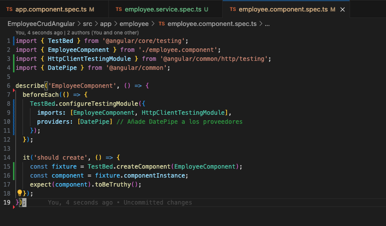

E\. Editamos el archivo addemployee.component.spec.ts ubicado en la carpeta **addemployee** reemplazando su contenido por:

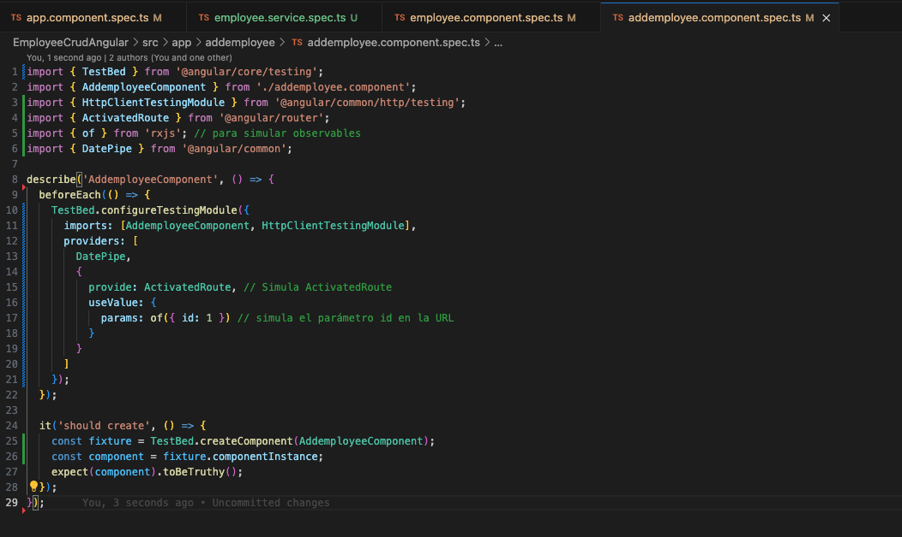

F\. En el directorio raiz de nuestro proyecto EmployeeCrudAngular ejecutamos el comando

```bash
ng test
```

G\. Vemos que se abre una ventana de Karma con Jasmine en la que nos indica que los tests se ejecutaron correctamente

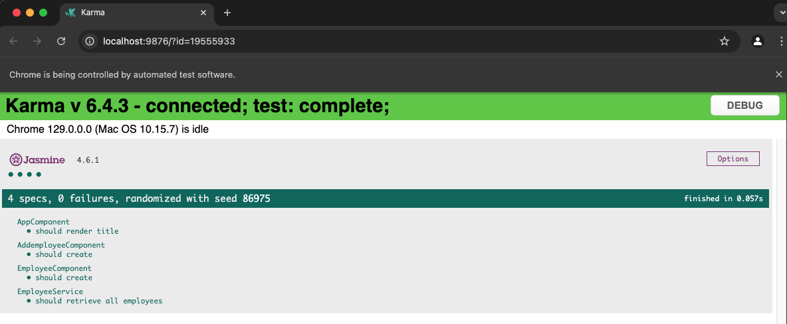

H\. Vemos que los tests se ejecutaron correctamente:

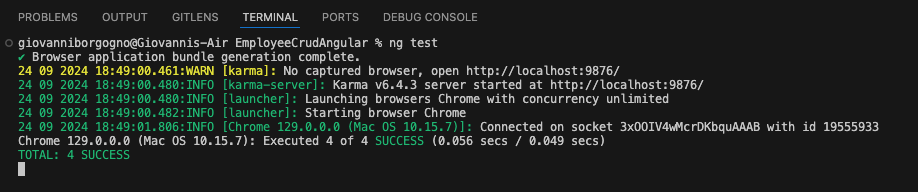

I\. Verificamos que no esté corriendo nuestra API navegando a http://localhost:7150/swagger/index.html y recibiendo esta salida:

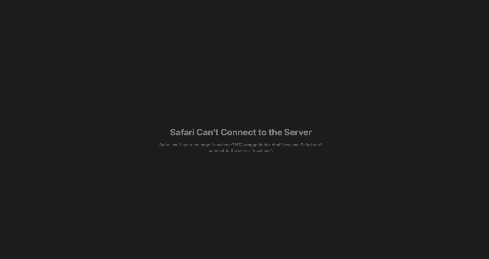

J\. Los puntos G y H nos indican que se han ejecutado correctamente las pruebas inclusive sin tener acceso a la API, lo que confirma que es efectivamente un conjunto de pruebas unitarias que no requieres de una dependencia externa para funcionar.

#### 4.5 Agregamos generación de reporte XML de nuestras pruebas de front.

A\. Instalamos dependencia karma-junit-reporter

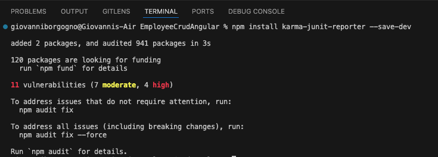

B\. En el directorio raiz de nuestro proyecto (al mismo nivel que el archivo angular.json) creamos un archivo karma.conf.js con el siguiente contenido

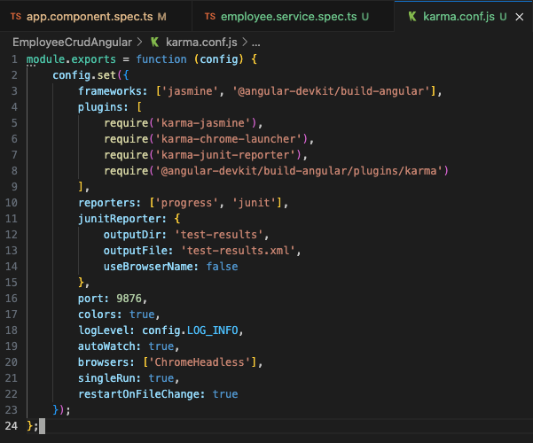

C\. Ejecutamos nuestros test de la siguiente manera:

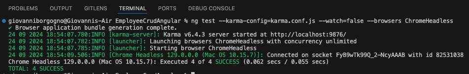

D\. Verificamos que se creo un archivo test-result.xml en el directorio test-results que está al mismo nivel que el directorio src

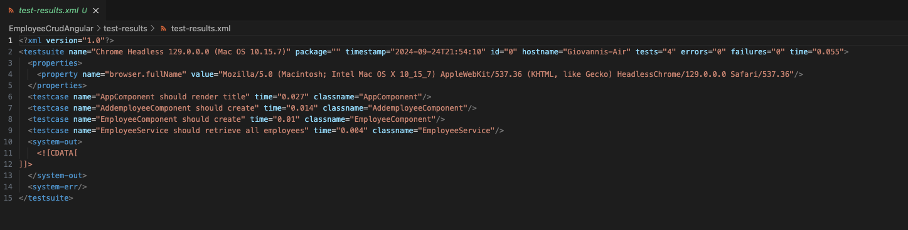

#### 4.6 Modificamos el código de nuestra API y creamos nuevas pruebas unitarias:

A\. Realizar al menos 5 de las siguientes modificaciones sugeridas al código de la API:

- Validar que el nombre tenga un número mínimo de caracteres, por ejemplo, al menos dos caracteres para evitar entradas inválidas como "A".
- Verificar que el nombre no contenga números, ya que no es común en los nombres de empleados.
- Asegurar que cada parte del nombre (separada por espacios) tenga al menos un carácter o más, por ejemplo, para evitar "A B".
- Verificar que no haya palabras vacías o que el nombre no esté compuesto solo de espacios.
- Prohibir el uso de nombres triviales o genéricos como "Empleado", "N/A", "Nombre", etc.

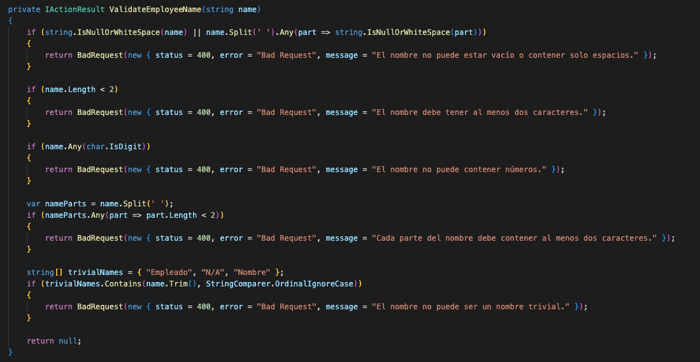

B\. Crear las pruebas unitarias necesarias para validar las modificaciones realizadas en el código

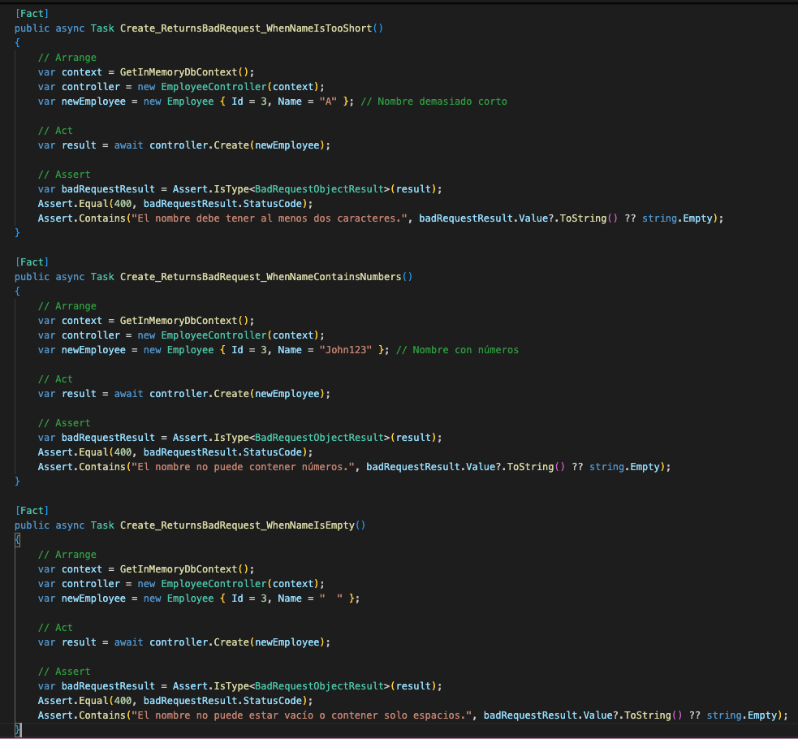
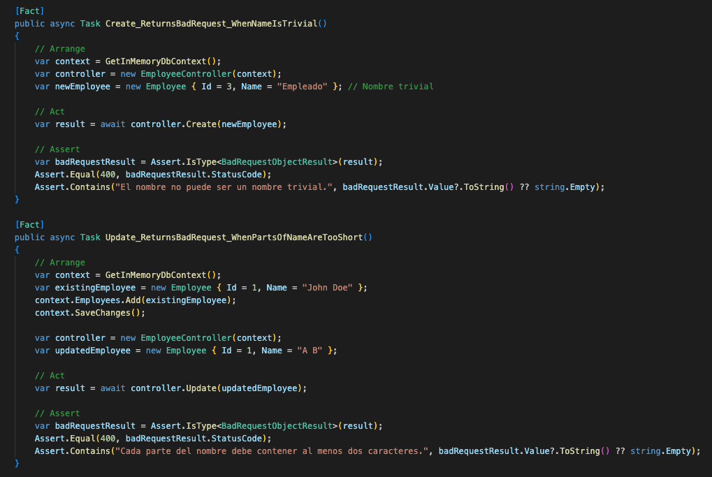
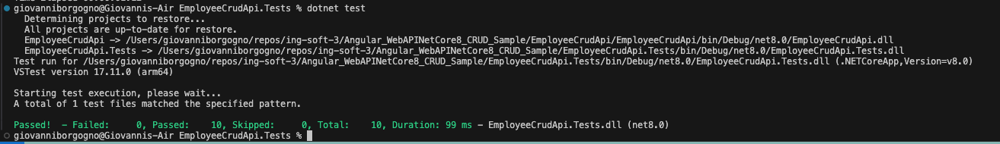

#### 4.7 Modificamos el código de nuestro Front y creamos nuevas pruebas unitarias:

A\. Realizar en el código del front las mismas modificaciones hechas a la API.

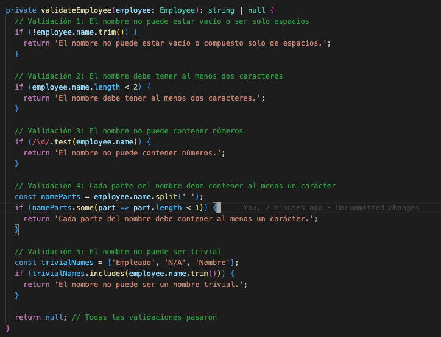


B\. Las validaciones deben ser realizadas en el front sin llegar a la API, y deben ser mostradas en un toast como por ejemplo https://stackblitz.com/edit/angular12-toastr?file=src%2Fapp%2Fapp.component.ts o https://stackblitz.com/edit/angular-error-toast?file=src%2Fapp%2Fcore%2Frxjsops.ts

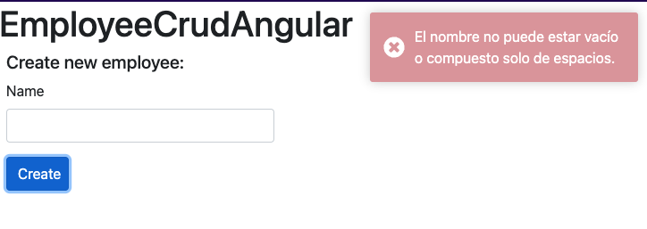
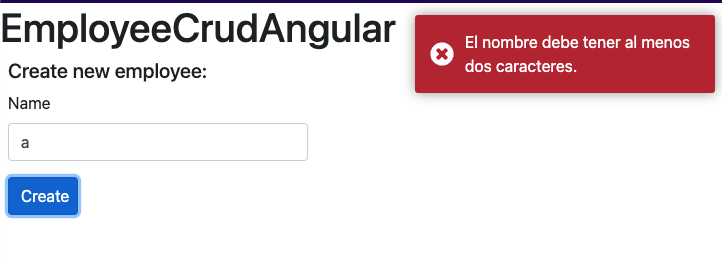
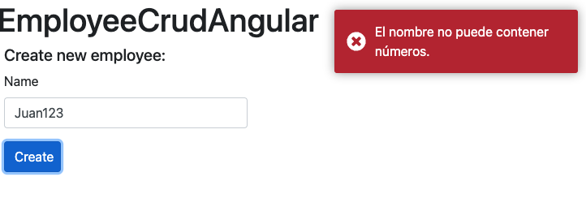

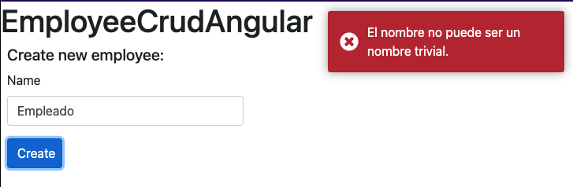

C\. Crear las pruebas unitarias necesarias en el front para validar las modificaciones realizadas en el código del front.

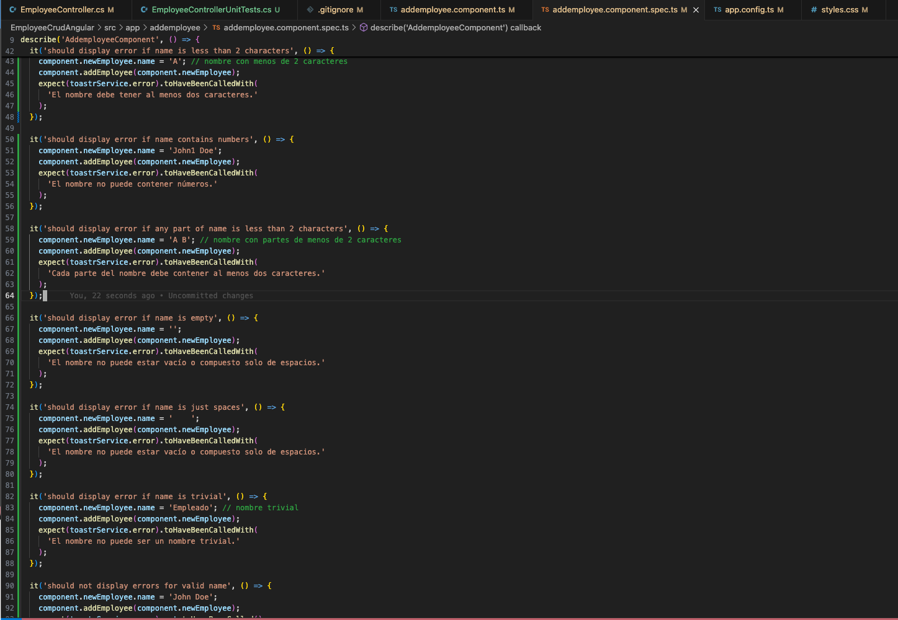

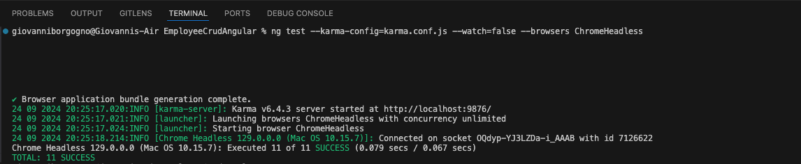

#### 6. Subir el proyecto

Link repositorio: https://github.com/giovaborgogno/Angular_WebAPINetCore8_CRUD_Sample