## Trabajo Práctico 7 - Code Coverage, Análisis estático de Código y Pruebas de Integración

### Desarrollo:

#### Prerequisitos:

#### 4.1 Agregar Code Coverage a nuestras pruebas unitarias de backend y front-end e integrarlas junto con sus resultados en nuestro pipeline de build.

##### 4.1.1 En el directorio raiz de nuestro proyecto Angular instalar el siguiente paquete:

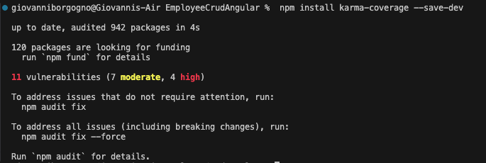

##### 4.1.2 Editar nuestro archivo karma.conf.js para que incluya reporte de cobertura

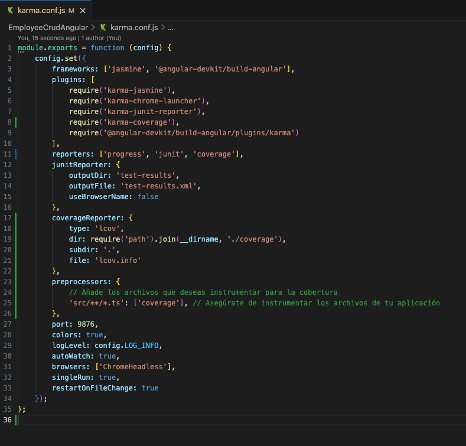

##### 4.1.3 En el dir raiz del proyecto EmployeeCrudApi.Tests ejecutar:

```bash
dotnet add package coverlet.collector
```

##### 4.1.4 Agregar a nuestro pipeline ANTES del Build de Back la tarea de test con los argumentos especificados y la de publicación de resultados de cobertura:

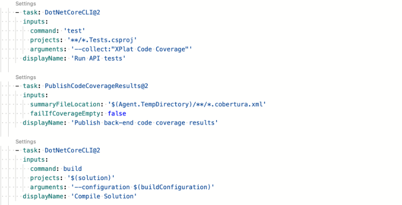

##### 4.1.5 Agregar a nuestro pipeline ANTES del Build de front la tarea de test y la de publicación de los resultados.

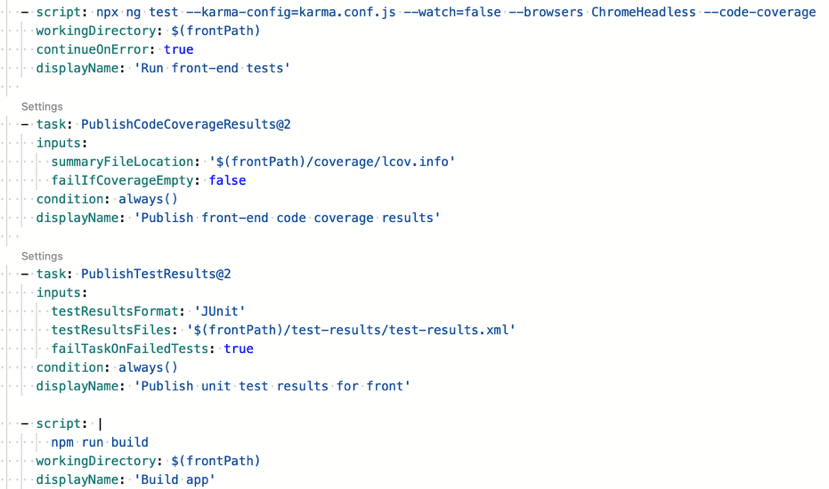

##### 4.1.6 Ejecutar el pipeline y analizar el resultado de las pruebas unitarias y la cobertura de código.

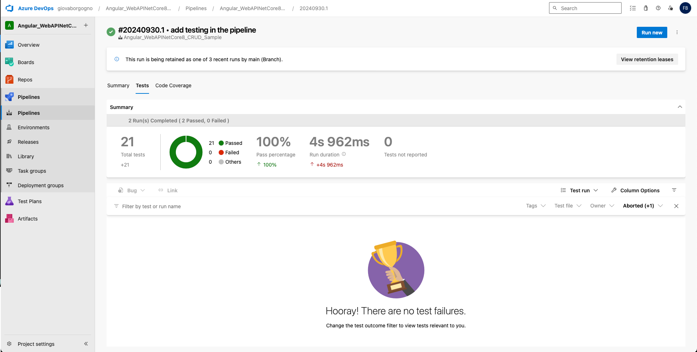
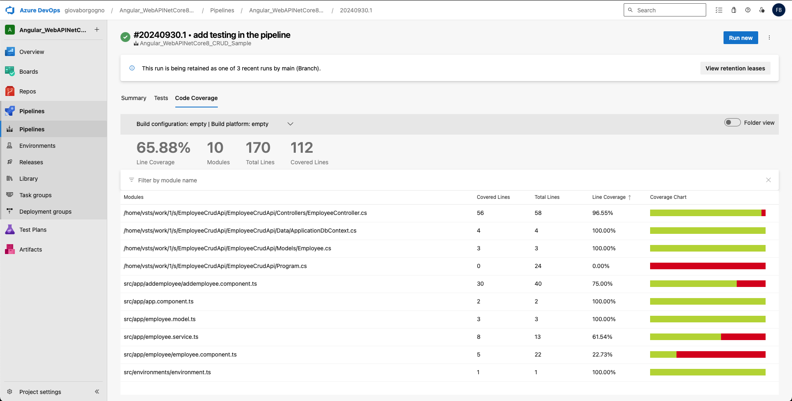

#### 4.2 Agregar Análisis Estático de Código con SonarCloud:

##### 4.2.1 Integraremos SonarCloud para analizar el código fuente. Configurar SonarCloud en nuestro pipeline siguiendo instructivo 5.1

- Antes de nuestra tarea de Build del Back:

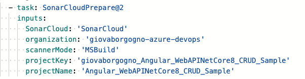

- Despues de nuestra tarea de Build del Back:

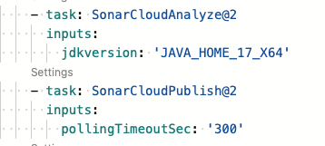

##### 4.2.2 Vemos el resultado de nuestro pipeline, en extensions tenemos un link al análisis realizado por SonarCloud

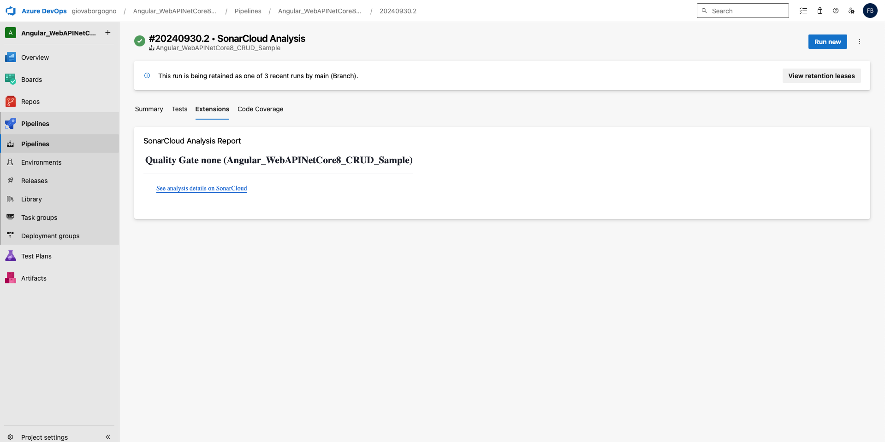

##### 4.2.3 Ir al link y analizar toda la información obtenida. Detallar en la entrega del TP los puntos más relevantes del informe, qué significan y para qué sirven.

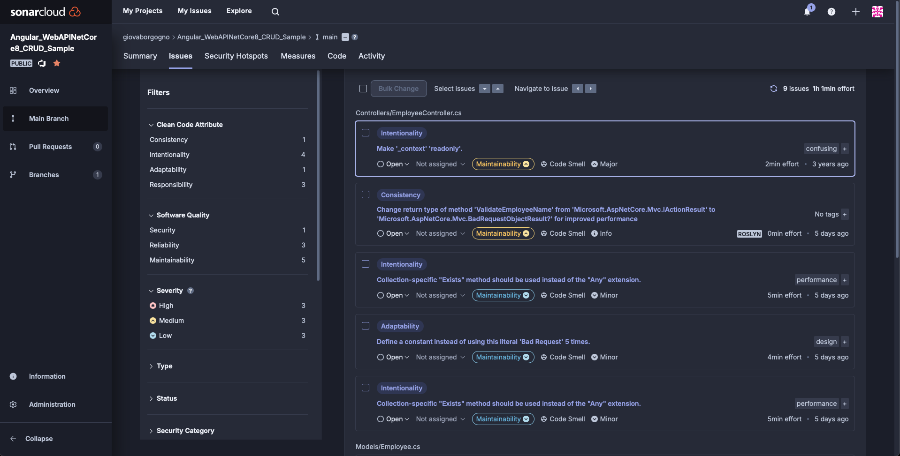

1. Clean Code Attributes

- **Consistencia**: Se refiere a la coherencia y estilo uniforme del código. Mantener un estilo consistente es esencial para mejorar la legibilidad y facilitar el mantenimiento.
  
- **Intencionalidad**: Este atributo evalúa si el código comunica claramente su propósito. Un código intencional es más fácil de comprender y mantener. Explica cómo esta claridad en la intención ayuda a otros desarrolladores a captar rápidamente el funcionamiento del código.

- **Adaptabilidad y Responsabilidad**: La Adaptabilidad no presenta problemas, mientras que la Responsabilidad tiene tres. La Adaptabilidad se refiere a la facilidad de modificar el código, mientras que la Responsabilidad evalúa si cada clase o método cumple con una única función. Enfatiza cómo una alta responsabilidad contribuye a un código limpio y modular.

2. Software Quality Attributes

- **Seguridad**: Se identifican problemas relacionados con la seguridad del código. Es crucial abordar y corregir estos problemas para evitar vulnerabilidades.   

- **Confiabilidad**: Este atributo mide la capacidad del software para funcionar correctamente bajo condiciones normales. La confiabilidad es vital para garantizar que la aplicación sea estable y opere según lo esperado.

- **Mantenibilidad**: Evalúa la facilidad con la que se puede mantener el código. Un código fácil de mantener minimiza el tiempo y esfuerzo requeridos para realizar cambios o corregir errores.

3. Severidad de los Problemas

- **Alta, Media, Baja**: Estas categorías indican la gravedad de los problemas detectados. La mayoría de los problemas son de severidad alta o media, lo que sugiere que son áreas críticas que requieren atención inmediata. 

4. Tipos de Problemas

- **Code Smells**: Los “code smells” son indicativos de problemas potenciales en el código que, aunque no son errores, pueden derivar en ellos o dificultar el mantenimiento. Ejemplos incluyen métodos demasiado largos, duplicación de código y un uso inadecuado de las estructuras del lenguaje. 

5. Ejemplos Específicos de Problemas

- **GetInMemoryDbContext**: Esta alerta indica que el método no accede a los datos de la instancia y podría ser declarado como static. Esta optimización puede contribuir a mejorar el rendimiento y la claridad del código.

- **Readonly Context**: Se sugiere declarar el contexto _context como readonly, una buena práctica que protege la integridad de los datos y previene modificaciones accidentales.

- **Uso de GeneratedRegexAttribute**: Se recomienda utilizar esta función para optimizar el rendimiento en tiempo de compilación, lo que es crucial para mejorar el rendimiento del software.

6. Esfuerzo Estimado

- SonarCloud proporciona un tiempo estimado para resolver cada problema, lo que ayuda a priorizar el trabajo y planificar las tareas necesarias para mejorar el código. 

7. Impacto en el Proyecto

- **Por qué es Importante**: La información obtenida de SonarCloud es fundamental para mantener la calidad del código, mejorar la mantenibilidad y evitar errores futuros. Los problemas de seguridad y confiabilidad deben ser abordados prioritariamente para garantizar que la aplicación sea segura y funcione correctamente.

- **Uso Práctico**: El informe generado por SonarCloud permite a los desarrolladores identificar y corregir problemas desde etapas tempranas, lo que resulta en un código más limpio, eficiente y seguro.

#### 4.3 Pruebas de Integración con Cypress:

##### 4.3.1 En el directorio raiz de nuestro proyecto Angular instalar el siguiente paquete:

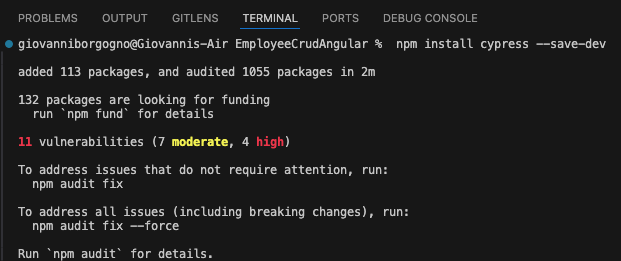

##### 4.3.2 Abrir Cypress:

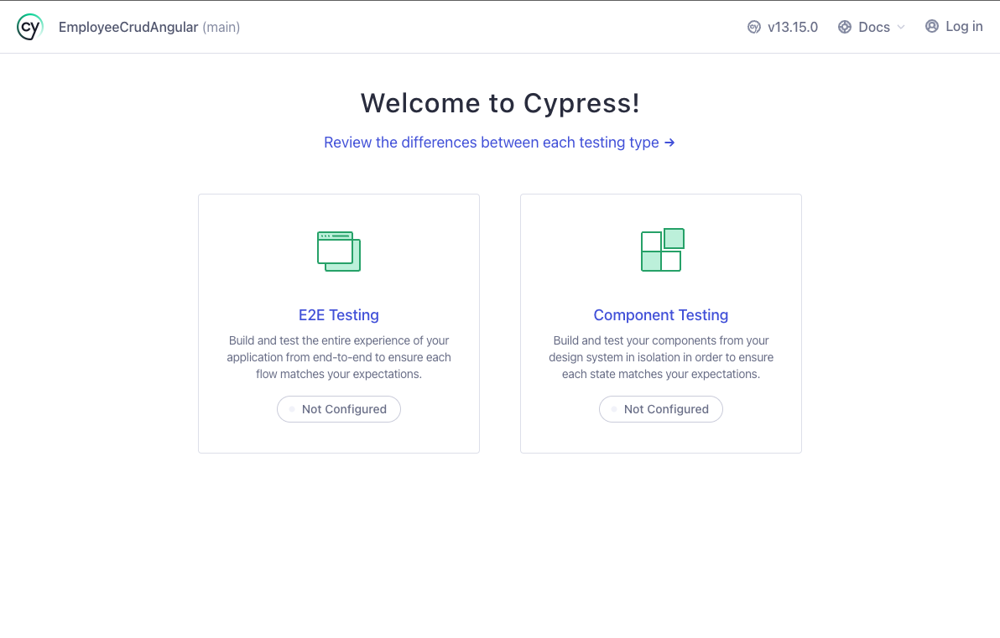

##### 4.3.3 Inicializar Cypress en nuestro proyecto como se indica en el instructivo 5.2

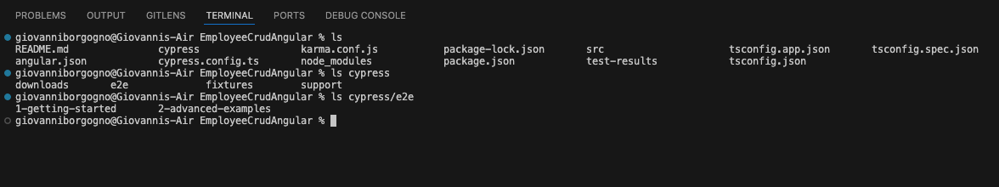

##### 4.3.4 Crear nuestra primera prueba navegando a nuestro front.

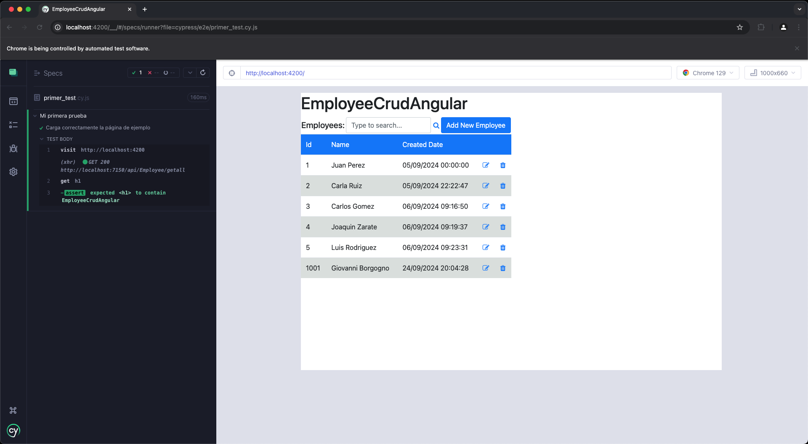

##### 4.3.5 Correr nuestra primera prueba

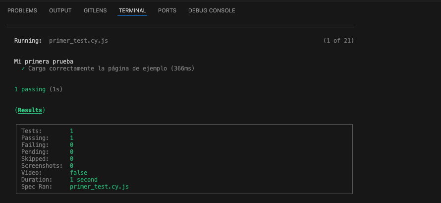

##### 4.3.6 Modificar nuestra prueba para que falle.

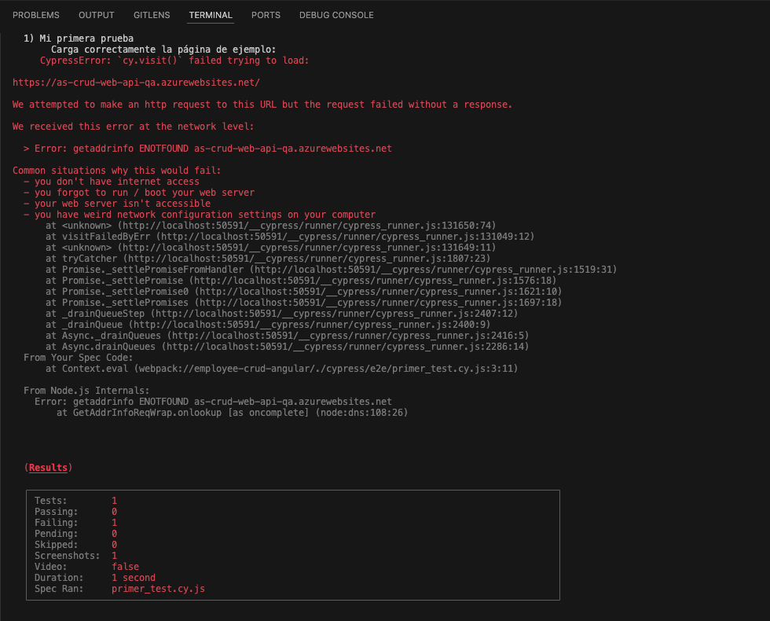

##### 4.3.6 Grabar nuestras pruebas para que Cypress genere código automático y genere reportes:

- Cerramos Cypress

- Editamos el archivo cypress.config.ts incluyendo la propiedad **experimentalStudio** en true y la configuración de reportería.

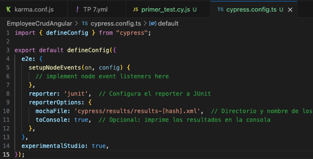

- Corremos nuevamente Cypress con npx cypress open, una vez que se ejecute nuestra prueba tendremos la opción de "Add Commands to Test". Esto permitirá interactuar con la aplicación y generar automáticamente comandos de prueba basados en las interacciones con la página:

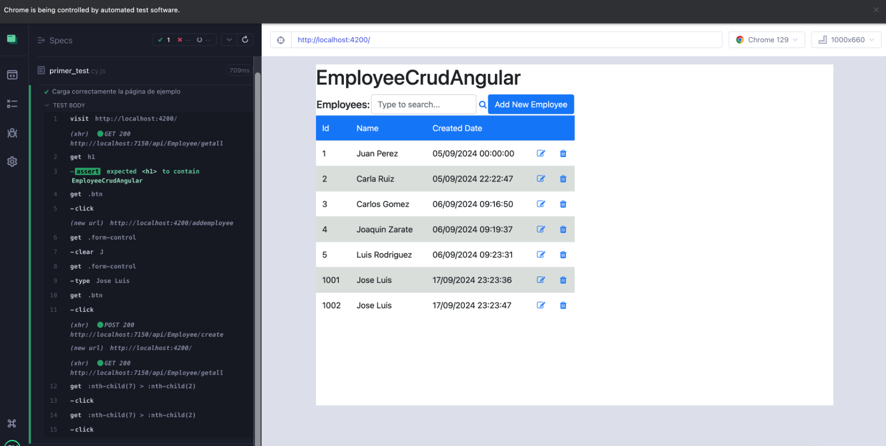

- Por ejemplo, si agregamos un nuevo empleado y luego verificamos que esté en la lista, Cypress nos generará un código como este:
- Por supuesto que habrá que hacerle ajustes, como por ejemplo que se fije siempre en la última fila de la grilla y no en la posición 15 como lo grabó, es ahí cuando consultando la documentación de Cypress debemos ver cómo modificar el código, en nuestro caso de ejemplo sería así:

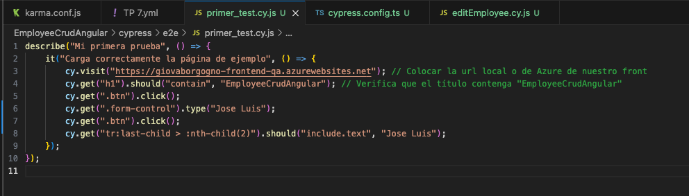

##### 4.3.7 Hacemos prueba de editar un empleado

- Creamos en cypress/e2e/ un archivo editEmployee_test.cy.js con el siguiente contenido, guardamos y aparecerá en Cypress:

- Hacemos "Add command to the test" y empezamos a interactuar con la página

- Hacemos algunos ajustes al código generado:

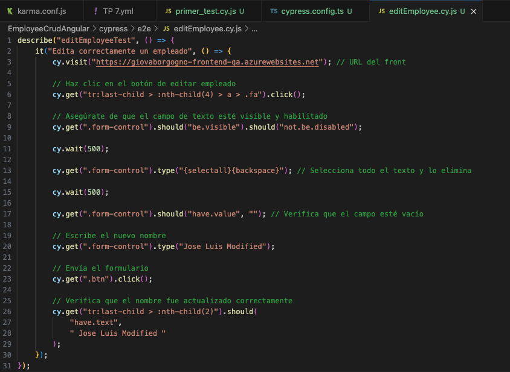

#### 4.4 Desafíos:

- Integrar en el pipeline SonarCloud para nuestro proyecto Angular, mostrar el resultado obtenido en SonarCloud
- Implementar en Cypress pruebas de integración que incluya los casos desarrollados como pruebas unitarias del front en el TP06.
- Incorporar al pipeline de Deploy la ejecución de las pruebas de integración y la visualización de sus resultados.
- **Resultado esperado**:

  - Un Pipeline en YAML que incluya a) Build de QA y Front con ejecución y resultado de pruebas de code coverage, pruebas unitarias y análisis de Sonar Cloud y b) Deploy a WebApp(s) de QA y Front que incluya ejecución y resultado de pruebas de integración

    https://dev.azure.com/giovaborgogno/_git/Sample02?path=/cicd.yml

  - Dos Stages: Una para Build, Test Unitarios, Code Coverage y SonarCloud y otra para el Deploy a QA con Tests de Integración

  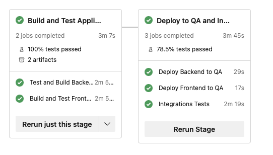

  - En la pestaña Test, poder visualizar los Test Unitarios de Front y Back y los Test de Integracion:

  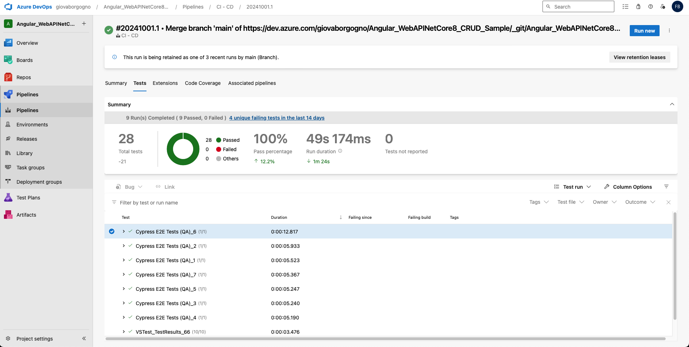

  - En la pestaña Code Coverage, visualizar la cobertura de las pruebas unitarias de Back y de Front:

  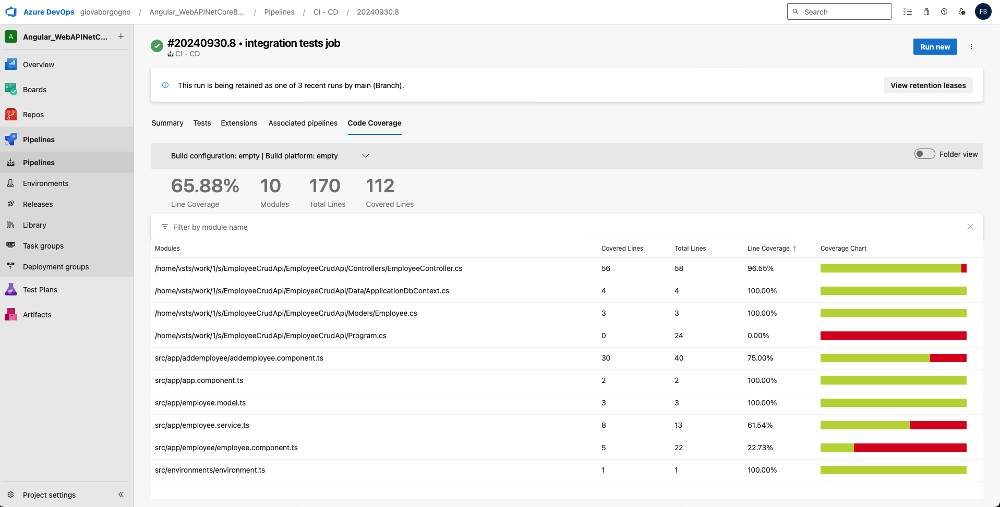

  - En la pestaña Extensions, ver el análisis de SonarCloud en verde

  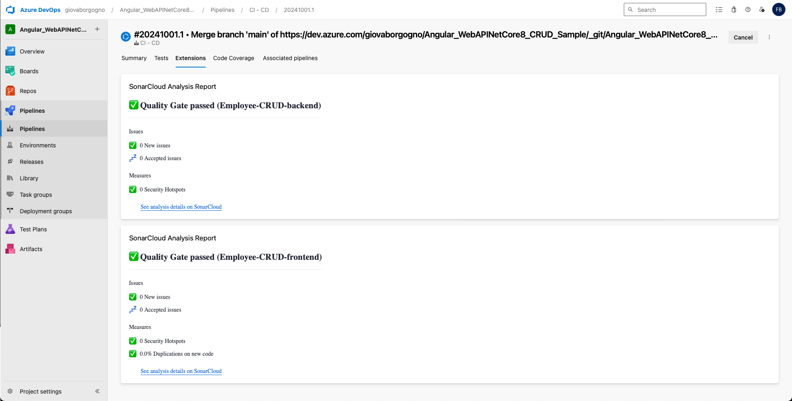

  - Un documento de una carilla explicando qué información pudieron sacar del análisis de Sonar Cloud y de las pruebas de cobertura.

### Informe de Análisis de SonarCloud y Cobertura de Código

#### Cobertura de Código

El análisis de cobertura de código muestra los siguientes resultados:

- Cobertura General: El sistema tiene una cobertura general del 65.88%. Esta cifra indica que casi dos tercios del código están cubiertos por pruebas unitarias, mientras que el 34.12% restante carece de pruebas, lo que podría representar un riesgo en las áreas no cubiertas.
- Cobertura por Módulos:
- EmployeeController.cs tiene una cobertura del 96.55% (56 de 58 líneas cubiertas), lo que sugiere que gran parte de la lógica del controlador está siendo adecuadamente probada.
- ApplicationDbContext.cs y Employee.cs cuentan con una cobertura del 100%, lo cual garantiza que todos los métodos y propiedades importantes de estos componentes están cubiertos por pruebas.
- Program.cs tiene una cobertura del 0%, ya que no se han implementado pruebas para este archivo principal de configuración. Esto podría representar un punto crítico y necesita atención, ya que contiene lógica de arranque esencial.
- En el frontend, el archivo addemployee.component.ts muestra un nivel de cobertura de 75% (30 de 40 líneas cubiertas), lo que es aceptable pero sugiere espacio para mejorar.
- employee.component.ts solo tiene un 22.73% de cobertura (5 de 22 líneas), lo que indica una brecha significativa en la cobertura que podría resultar en un riesgo elevado si este componente tiene lógica crucial.

Si separamos la cobertura del backend y frontend vemos que el frontend tiene un 60.49% de cobertura y el backend un 70.79%.

#### Hallazgos de SonarCloud

El análisis de SonarCloud reveló varios aspectos importantes relacionados con la calidad del código y la mantenibilidad:

- Estado de Calidad: El análisis de SonarCloud muestra que el estado de calidad en el backend y el frontend pasa los chequeos de calidad en términos generales, con los componentes etiquetados como “Passed” en la rama principal.
- Frontend:
	- No se han encontrado vulnerabilidades de seguridad críticas ni errores importantes.
	- Problemas de Mantenibilidad: El frontend muestra 26 problemas de mantenibilidad, principalmente de nivel bajo, con un tiempo estimado de resolución de 19 minutos.
	- Reliability: Hay 6 problemas de fiabilidad clasificados, con 4 minutos de deuda técnica, lo que podría indicar áreas de código que podrían no comportarse de forma esperada en ciertas condiciones.
	- Duplicación: El frontend muestra un nivel de duplicación bajo, con solo un 0.3% de duplicación en 15k líneas analizadas, lo que es positivo.
- Backend:
	- Seguridad: No se han encontrado problemas de seguridad en el frontend.
	- Reliability: En el backend se encontraron 3 problemas de fiabilidad, con un tiempo estimado de resolución de 2 horas, que podrían requerir atención para evitar errores en el comportamiento del sistema.
	- Mantenibilidad: Hay 5 problemas de mantenibilidad identificados, pero no se clasifican como críticos.

#### Recomendaciones

1. Aumentar la cobertura en áreas críticas:
	- Implementar pruebas unitarias para Program.cs, ya que tiene un rol crucial en la inicialización del sistema.
	- Incrementar la cobertura en el frontend, especialmente en los componentes con cobertura del 0% como employee.component.ts.
2. Corregir problemas de fiabilidad y mantenibilidad:
	- Revisar los problemas de fiabilidad en el frontend (6 problemas abiertos) y backend (3 problemas abiertos) para garantizar un comportamiento predecible.
	- Abordar los 26 problemas de mantenibilidad del frontend para evitar deudas técnicas a largo plazo.
3. Seguir monitoreando la duplicación:
	- Aunque la duplicación en el frontend es baja (0.3%), se debe monitorear para evitar que se incremente en el futuro a medida que el sistema crezca.
4. Configurar análisis de cobertura en SonarCloud:
	- Actualmente, si bien el analisis de cobertura se hace en el pipeline, la cobertura de pruebas no se está informando adecuadamente en SonarCloud para el frontend. Es importante configurar la herramienta para que reporte correctamente y pueda dar seguimiento a las métricas de calidad.

#### Conclusión

El sistema está en un buen estado de calidad general, con un nivel aceptable de cobertura en el backend. Sin embargo, el frontend requiere una mejora significativa en cuanto a cobertura de pruebas y algunos problemas de mantenibilidad. Es recomendable priorizar estas áreas para garantizar la estabilidad y calidad del código a medida que el proyecto evoluciona.

### Subir a proyecto de Azure DevOps

Link repositorio: https://dev.azure.com/giovaborgogno/_git/Angular_WebAPINetCore8_CRUD_Sample

### Criterio de Calificación

Los pasos 4.1 al 4.3 representan un 60% de la nota total, los pasos 4.4 y subsiguientes representan el 40% restante.
